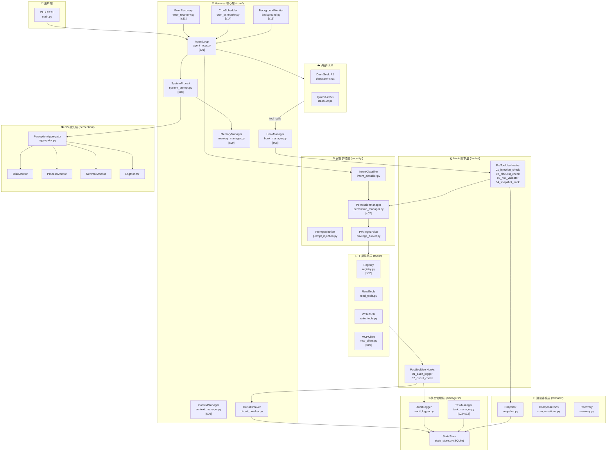
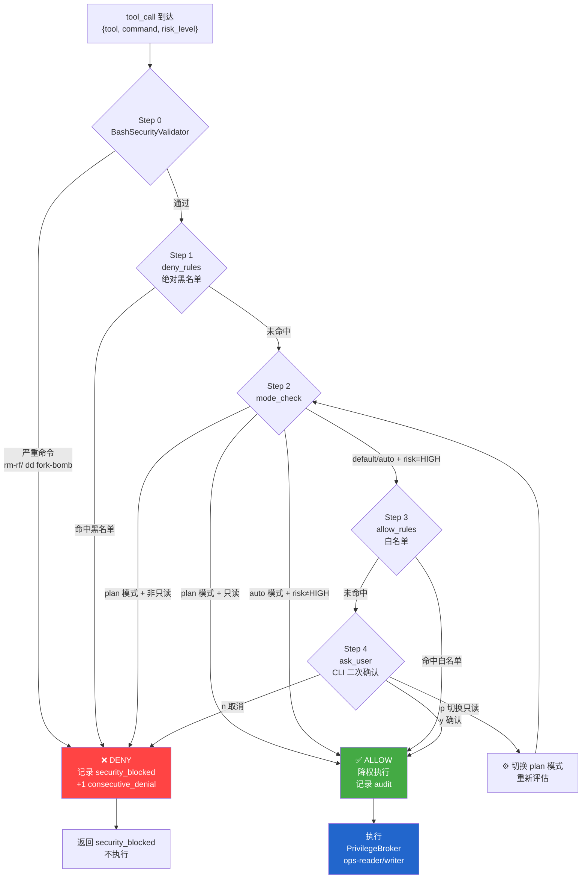
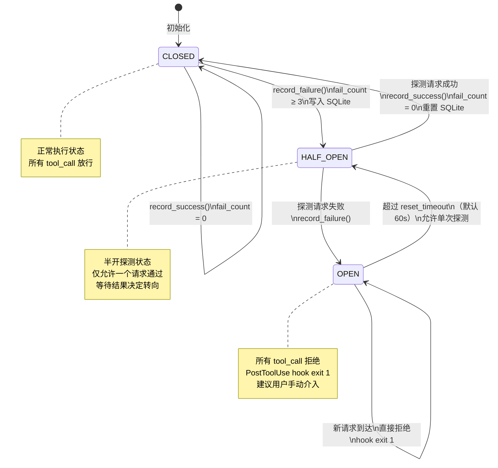
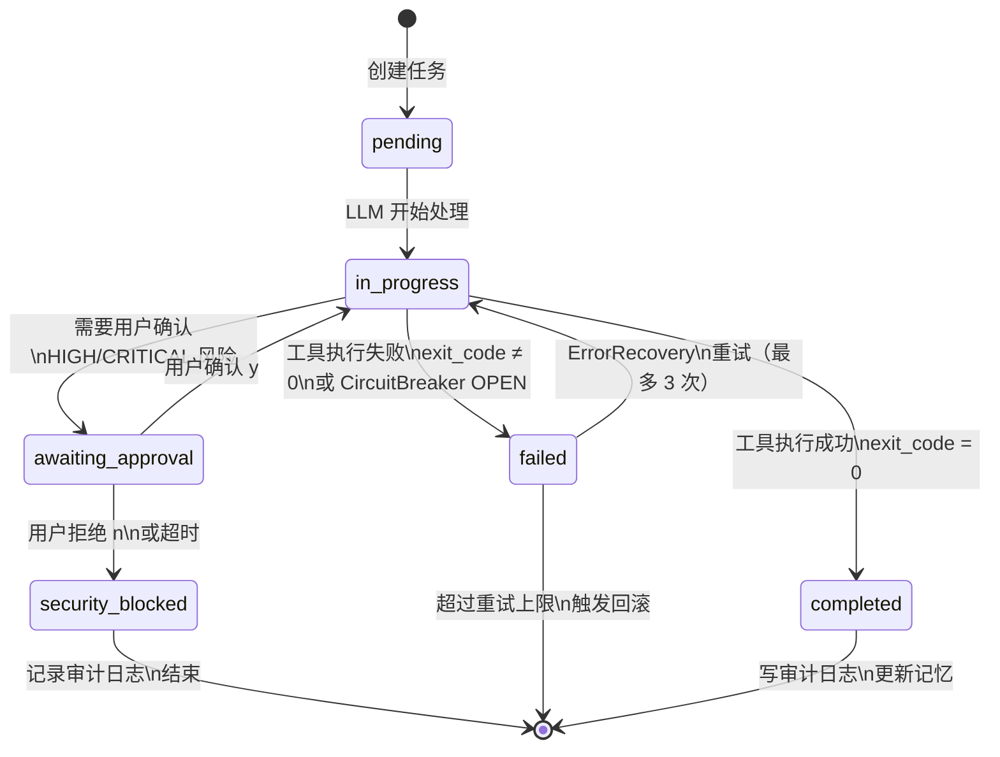
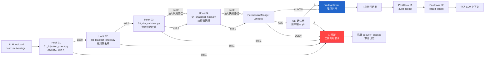
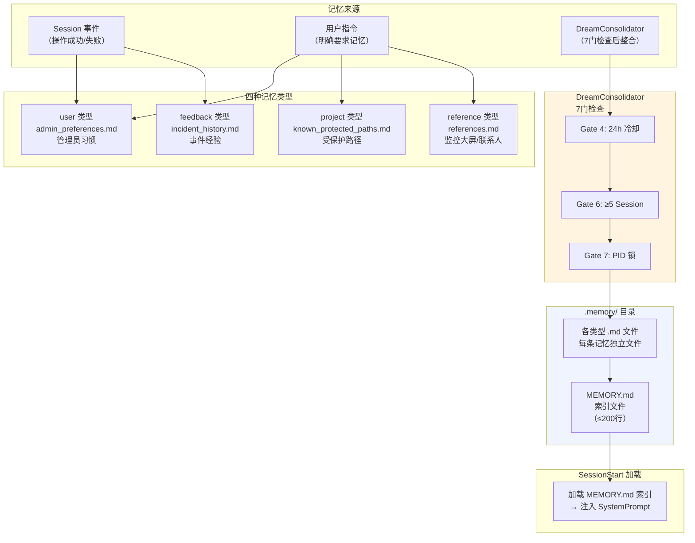

# OpsAgent v2.0 — 架构图集

> 所有图表使用 Mermaid 语法，可在 GitHub / GitLab / VS Code 预览。

---

## 图 1：系统分层架构（Layer Architecture）



---

## 图 2：完整请求生命周期时序图（Sequence Diagram）

```mermaid
sequenceDiagram
    autonumber
    actor User
    participant CLI as main.py
    participant Loop as AgentLoop
    participant IC as IntentClassifier
    participant PM as PermissionManager
    participant SP as SystemPrompt
    participant Perc as PerceptionAggregator
    participant LLM as DeepSeek/Qwen3
    participant HM as HookManager
    participant Pre as PreToolUse Hooks
    participant Snap as Snapshot
    participant PB as PrivilegeBroker
    participant Post as PostToolUse Hooks
    participant AL as AuditLogger
    participant CB as CircuitBreaker
    participant Mem as MemoryManager

    User->>CLI: "帮我清理系统垃圾"
    CLI->>Loop: run(user_input)

    Note over Loop: [SessionStart Hook] 加载记忆

    Loop->>Mem: load_session_context()
    Mem-->>Loop: {known_protected_paths, admin_prefs}

    Loop->>IC: classify(user_input)
    IC->>IC: 规则引擎匹配 YAML
    alt 规则命中
        IC-->>Loop: {intent: cleanup, risk: MEDIUM}
    else UNKNOWN → LLM 审查
        IC->>LLM: security_review(input)
        LLM-->>IC: {risk: MEDIUM}
        IC-->>Loop: {intent: cleanup, risk: MEDIUM}
    end

    Loop->>PM: mode_check(risk=MEDIUM, mode=default)
    PM-->>Loop: ALLOWED (proceed)

    Loop->>Perc: collect_snapshot()
    Perc-->>Loop: {disk: /var/log/mysql=47GB, procs: [...]}

    Loop->>SP: build(perception, memory, task)
    SP-->>Loop: system_prompt_string

    Loop->>LLM: chat_completion(messages, tools)
    LLM-->>Loop: tool_call(bash, "rm /var/log/mysql/slow.log")

    Note over Loop: 对每个 tool_call 执行 Hook 管道

    Loop->>HM: run_pre_hooks(tool_call)
    HM->>Pre: 01_injection_check.py
    Pre-->>HM: exit 0 ✅

    HM->>Pre: 02_blacklist_check.py
    Pre-->>HM: exit 0 ✅

    HM->>Pre: 03_risk_validator.py
    Pre-->>HM: exit 2 ⚠️ "数据库路径 + rm → 升级 HIGH"
    Note over HM: 注入上下文消息

    HM->>Pre: 04_snapshot_hook.py
    Pre->>Snap: take_snapshot(op_id, path)
    Snap-->>Pre: snapshot_path
    Pre-->>HM: exit 2 ⚠️ "快照已创建: .snapshots/op_x1_..."
    Note over HM: 注入快照路径消息

    HM-->>Loop: pre_hooks_result

    Loop->>PM: check(tool=bash, cmd=rm, risk=HIGH)
    PM->>PM: deny_rules → 不命中
    PM->>PM: mode_check → default 模式，HIGH → ask
    PM->>CLI: prompt_user(confirm=HIGH)
    CLI->>User: ⚠️ HIGH 风险操作确认框
    User->>CLI: y (确认)
    CLI-->>PM: CONFIRMED
    PM-->>Loop: EXECUTE

    Loop->>CB: check_state()
    CB-->>Loop: CLOSED ✅

    Loop->>PB: execute_as(uid=ops-writer, cmd)
    PB-->>Loop: {exit_code: 0, stdout: ""}

    Loop->>HM: run_post_hooks(result)
    HM->>Post: 01_audit_logger.py
    Post->>AL: write_jsonl(phase=execute, op_id, exit_code=0)
    Post-->>HM: exit 0 ✅

    HM->>Post: 02_circuit_check.py
    Post->>CB: record_success()
    CB-->>Post: CLOSED
    Post-->>HM: exit 0 ✅

    Loop->>LLM: tool_result → final response
    LLM-->>Loop: "已删除 /var/log/mysql/slow.log（47GB）"

    Loop->>AL: write_jsonl(phase=complete, bytes_freed=47GB)
    Loop->>Mem: maybe_save(event="slow.log confirmed delete")

    Loop-->>CLI: final_answer
    CLI-->>User: "已删除 slow.log（47GB），快照保留 24 小时"
```

---

## 图 3：权限管道状态机（PermissionManager）



---

## 图 4：熔断器状态机（CircuitBreaker）



---

## 图 5：任务状态机（TaskManager — 6态 FSM）



---

## 图 6：Hook 管道执行流程（PreToolUse Detail）



---

## 图 7：记忆系统架构（MemoryManager）



---

## 图 8：项目目录结构树（Directory Tree）

```
ops-agent/
│
├── 📄 main.py                    # REPL 入口（asyncio.run）
├── 📄 config.py                  # AgentConfig + MODEL_PROFILES
├── 📄 CLAUDE.md                  # Claude Code 上下文文件
├── 📄 DESIGN.md                  # 架构设计文档 v2.0
├── 📄 requirements.txt
├── 📄 .env.example
├── 📄 .hooks.json                # Hook 配置
│
├── 📁 docs/
│   ├── PRD.md                   ← 本文件
│   ├── ARCHITECTURE.md          ← 架构图集（本文件）
│   ├── DOC-1-security-layer.md
│   ├── DOC-2-state-resilience.md
│   ├── DOC-3-rollback-audit.md
│   └── DOC-4-main-loop.md
|
│
├── 📁 core/                      # [s01,s06,s08-s14,s17,s18]
│   ├── agent_loop.py             # LoopState 主循环
│   ├── subagent.py               # 子 Agent 工厂
│   ├── context_manager.py        # 三策略压缩
│   ├── hook_manager.py           # Hook 执行器
│   ├── memory_manager.py         # 跨 Session 记忆
│   ├── system_prompt.py          # 动态 prompt 组装
│   ├── error_recovery.py         # 三策略恢复
│   ├── background.py             # OS 后台监控线程
│   ├── cron_scheduler.py         # Cron 调度器
│   ├── autonomous.py             # 自治巡检模式
│   ├── isolation.py              # op_id 绑定隔离
│   └── circuit_breaker.py        # 熔断器
│
├── 📁 hooks/                     # [s08] 外置安全脚本
│   ├── pre_tool/
│   │   ├── 01_injection_check.py
│   │   ├── 02_blacklist_check.py
│   │   ├── 03_risk_validator.py
│   │   └── 04_snapshot_hook.py
│   └── post_tool/
│       ├── 01_audit_logger.py
│       └── 02_circuit_check.py
│
├── 📁 perception/                # OS 感知层
│   ├── aggregator.py
│   ├── disk_monitor.py
│   ├── process_monitor.py
│   ├── network_monitor.py
│   └── log_monitor.py
│
├── 📁 security/                  # [s07] + OpsAgent 专属
│   ├── permission_manager.py     # 4步管道
│   ├── intent_classifier.py      # 规则+LLM 混合分类
│   ├── prompt_injection.py       # 注入检测
│   ├── privilege_broker.py       # 最小权限执行
│   └── rules/
│       └── intent_rules.yaml     # 可热更新规则
│
├── 📁 tools/                     # [s02,s19]
│   ├── registry.py
│   ├── mcp_client.py
│   ├── mcp_router.py
│   ├── plugin_loader.py
│   ├── read_tools.py
│   ├── write_tools.py
│   └── exec_tools.py
│
├── 📁 managers/                  # 状态管理
│   ├── state_store.py            # SQLite 后端
│   ├── task_manager.py           # 6态 FSM
│   └── audit_logger.py           # 8 phase JSONL
│
├── 📁 rollback/                  # 三级快照补偿
│   ├── snapshot.py
│   ├── compensations.py
│   └── recovery.py
│
├── 📁 teams/                     # [s15,s16]
│   ├── analyst.py
│   ├── executor.py
│   └── protocols.py
│
├── 📁 skills/                    # [s05] 运维手册
│   ├── disk-cleanup/SKILL.md
│   ├── process-management/SKILL.md
│   └── log-analysis/SKILL.md
│
├── 📁 .memory/                   # [s09] 运行时生成
├── 📁 .audit/                    # 审计日志，运行时生成
├── 📁 .snapshots/                # 快照，运行时生成
├── 📁 .claude/
│   └── scheduled_tasks.json      # durable cron 持久化
│
└── 📁 tests/
    ├── conftest.py
    ├── test_permission_manager.py
    ├── test_hook_manager.py
    ├── test_intent_classifier.py
    ├── test_circuit_breaker.py
    ├── test_snapshot.py
    ├── test_memory_manager.py
    ├── test_cron_scheduler.py
    ├── test_error_recovery.py
    ├── test_state_store.py
    ├── test_task_manager.py
    ├── test_privilege_broker.py
    ├── test_audit_logger.py
    ├── test_mcp_client.py
    └── test_agent_loop.py         # 集成测试（Mock LLM）
```
