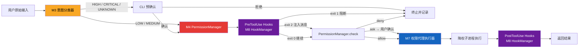
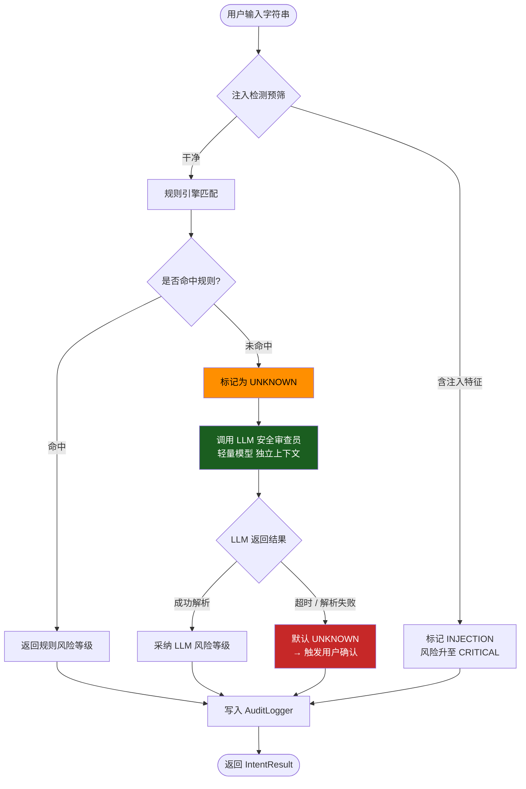
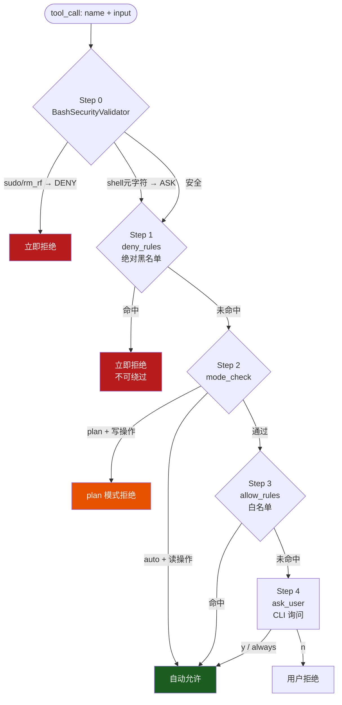
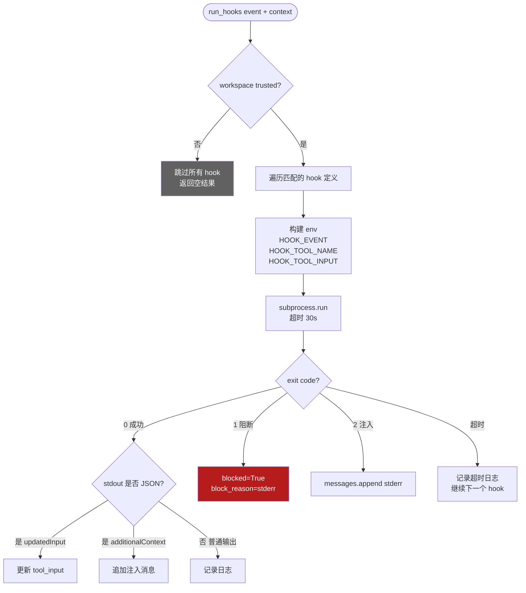
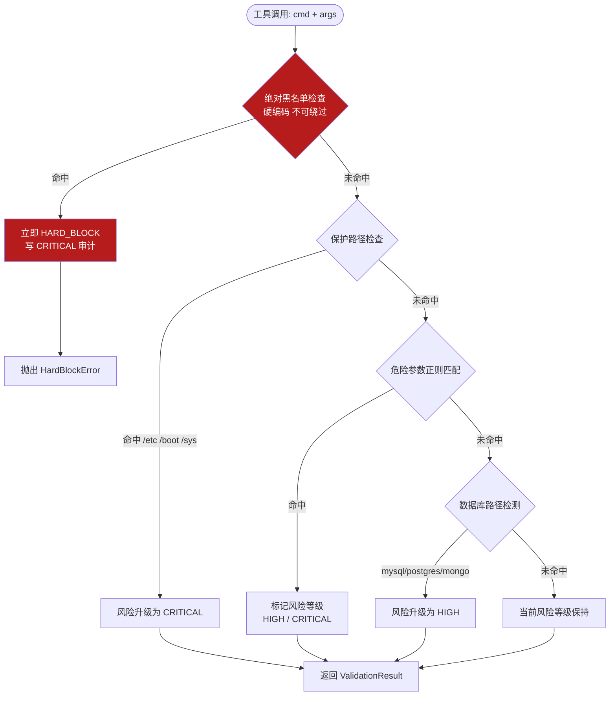
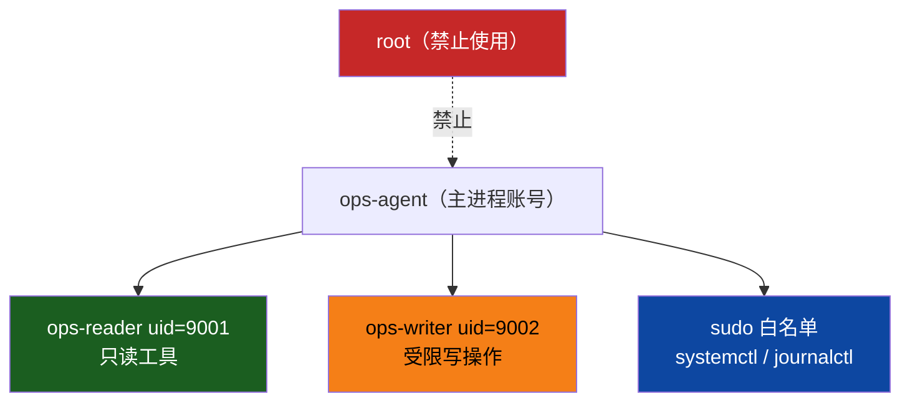
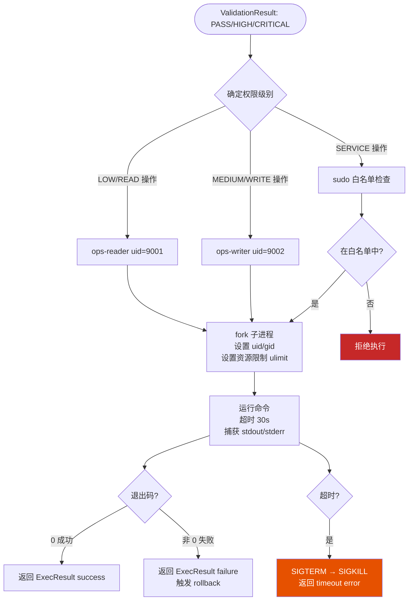

# DOC-1：安全护栏层技术实现方案（v2.0）

> 覆盖模块：M3 `intent_classifier` · M4 `permission_manager`（原 command_validator，v2.0 重构）· M7 `privilege_broker` · M8 `hook_manager`  
> 安全核心原则：**纵深防御**——安全逻辑通过 Hook 外置，主循环保持薄层；任何一道门不依赖其他门的正常工作  
>
> **v2.0 变更**：M4 对齐 s07 `PermissionManager` 4步管道 + 三种 mode；新增 M8 `HookManager`（s08）

---

## 总体安全管道（v2.0 Hook 外置架构）



---

## M3：意图分类器 `security/intent_classifier.py`

### 职责

将用户的**自然语言指令**映射为风险等级（LOW / MEDIUM / HIGH / CRITICAL / UNKNOWN），为后续安全门提供决策依据。采用**规则引擎优先、LLM 兜底**的混合策略。

### 核心流程图



### 关键数据结构与接口签名

```python
from dataclasses import dataclass, field
from enum import Enum
from typing import Literal

class RiskLevel(str, Enum):
    LOW      = "LOW"
    MEDIUM   = "MEDIUM"
    HIGH     = "HIGH"
    CRITICAL = "CRITICAL"
    UNKNOWN  = "UNKNOWN"
    INJECTION = "INJECTION"

@dataclass
class IntentResult:
    risk:       RiskLevel
    category:   str               # e.g. "disk_cleanup", "process_kill"
    confidence: float             # 0.0 ~ 1.0
    classifier: Literal["rule", "llm", "default"]
    raw_input:  str
    reason:     str               # 人类可读的判定理由

class IntentClassifier:
    def __init__(
        self,
        rule_path: str,           # YAML 规则文件路径
        llm_client: "LLMClient",  # 轻量安全审查模型
        timeout: float = 3.0,
    ) -> None: ...

    def classify(self, user_input: str) -> IntentResult:
        """同步入口，内部调用异步实现"""

    async def aclassify(self, user_input: str) -> IntentResult:
        """主分类逻辑"""

    def _match_rules(self, text: str) -> IntentResult | None:
        """规则引擎匹配，命中返回结果，未命中返回 None"""

    async def _llm_review(self, text: str) -> IntentResult:
        """LLM 安全审查员调用，带超时保护"""

    def _check_injection(self, text: str) -> bool:
        """提示词注入预筛"""
```

### 关键算法伪代码

```
function aclassify(user_input):

    # 第一步：注入预筛（最快速，纯字符串匹配）
    if _check_injection(user_input):
        return IntentResult(risk=INJECTION, classifier="rule", ...)

    # 第二步：规则引擎匹配
    result = _match_rules(user_input)
    if result is not None:
        return result  # 命中规则，直接返回

    # 第三步：LLM 安全审查（独立上下文）
    try:
        with timeout(3.0 seconds):
            llm_resp = await _llm_review(user_input)
            parsed   = parse_json(llm_resp)   # {"risk": "HIGH", "reason": "..."}
            return IntentResult(
                risk=parsed.risk,
                classifier="llm",
                reason=parsed.reason
            )
    except TimeoutError:
        # 超时：默认保守，标记 UNKNOWN 触发用户确认
        return IntentResult(risk=UNKNOWN, classifier="default",
                            reason="LLM 审查超时，需用户确认")
    except ParseError:
        return IntentResult(risk=UNKNOWN, classifier="default",
                            reason="LLM 返回格式异常")
```

**规则文件结构（YAML）**：

```yaml
# security/rules/intent_rules.yaml
rules:
  - pattern: "(查看|显示|列出|检查|监控|状态)"
    risk: LOW
    category: read_only

  - pattern: "(分析|统计|找出|诊断)"
    risk: MEDIUM
    category: analysis

  - pattern: "(删除|清理|移除|停止|关闭|杀死)"
    risk: HIGH
    category: destructive_write

  - pattern: "(格式化|清空|重置|覆盖|wipefs|mkfs)"
    risk: CRITICAL
    category: catastrophic
```

**LLM 安全审查员 Prompt 模板**：

```
你是一个 Linux 运维安全审查员。分析以下用户指令的风险等级。

用户指令：{user_input}

规则：
- LOW: 只读操作，不改变系统状态
- MEDIUM: 可能读取敏感信息，无写入
- HIGH: 会修改或删除文件/配置/服务
- CRITICAL: 不可逆操作，可能导致系统不可用

严格返回 JSON，格式：
{"risk": "HIGH", "category": "disk_operation", "reason": "包含 rm 删除操作"}

不要返回任何其他内容。
```

### 异常处理与安全边界

| 失效场景 | 后果 | 应对策略 |
|---------|------|---------|
| 规则文件损坏或丢失 | 规则引擎失效 | 启动时校验规则文件 hash；失败则拒绝启动 |
| LLM 审查员 API 不可用 | 无法分类 UNKNOWN | 超时降级为 UNKNOWN，**触发用户确认**（保守策略） |
| 攻击者构造绕过规则的输入 | 低风险误判 | LLM 作为二道防线；M4 指令校验器作为第三道防线 |
| LLM 审查员被提示词注入 | 返回错误风险等级 | 审查员使用**独立 system prompt**，不携带用户原始上下文；响应严格 JSON 解析 |

> **失效安全原则**：任何异常（超时/解析失败/模型错误）一律升级为需要用户确认，绝不降级放行。

---

## M4：权限管理器 `security/permission_manager.py`（v2.0 重构）

> v1.x 的 `command_validator.py` 已升级为对齐 s07 的 `PermissionManager`，原有黑名单/规则逻辑保留在内部，同时新增三种运行 mode 和 4步决策管道。

### 职责

对 LLM 生成的每一个 **tool_call** 做执行级权限决策。  
**与 M3 IntentClassifier 的分工**：M3 在 LLM 调用**之前**对自然语言做意图级风险评估；M4 在执行**之前**对具体命令做权限决策。

### 三种运行 Mode

| Mode | 适用场景 | 写操作行为 |
|------|---------|-----------|
| `default` | 日常运维对话 | 询问用户（ask） |
| `plan` | 只读排查模式 | 全部拒绝（deny）|
| `auto` | 已知可信批量操作 | 非高危写操作自动放行 |

运行时可通过 REPL 命令切换：`/mode plan`

### 核心流程图（4步管道）



### 关键数据结构与接口签名

```python
import re
from fnmatch import fnmatch
from dataclasses import dataclass
from typing import Literal

MODES = ("default", "plan", "auto")

class BashSecurityValidator:
    """Step 0：bash 命令语义级安全校验（来自 s07）"""
    VALIDATORS = [
        ("shell_metachar",   r"[;&|`$]"),
        ("sudo",             r"\bsudo\b"),
        ("rm_rf",            r"\brm\s+(-[a-zA-Z]*)?r"),
        ("cmd_substitution", r"\$\("),
        ("ifs_injection",    r"\bIFS\s*="),
    ]
    SEVERE = {"sudo", "rm_rf"}   # 直接 deny；其余 ask

    def validate(self, command: str) -> list[tuple[str, str]]: ...
    def is_safe(self, command: str) -> bool: ...
    def describe_failures(self, command: str) -> str: ...

@dataclass
class PermissionDecision:
    behavior:  Literal["allow", "deny", "ask"]
    reason:    str
    mode_used: str          # 哪个 step 做出了决定

class PermissionManager:
    """s07 对齐：4步管道 + 三种 mode"""

    def __init__(
        self,
        mode:  str  = "default",
        rules: list = None,
    ) -> None:
        self.mode = mode
        self.rules = rules or list(DEFAULT_RULES)
        self.consecutive_denials = 0
        self.max_consecutive_denials = 3
        self._bash_validator = BashSecurityValidator()

    def check(self, tool_name: str, tool_input: dict) -> PermissionDecision:
        """4步管道决策"""

    def ask_user(self, tool_name: str, tool_input: dict) -> bool:
        """CLI 询问；'always' 添加永久 allow 规则"""

    def switch_mode(self, new_mode: str) -> None:
        """运行时切换 mode（/mode plan 命令）"""

    def _matches(self, rule: dict, tool_name: str, tool_input: dict) -> bool:
        """规则匹配：tool名 + path glob + content fnmatch"""
```

### 关键算法伪代码

```
DEFAULT_RULES = [
    # 绝对黑名单（deny，Step 1）
    {"tool": "bash", "content": "rm -rf /",      "behavior": "deny"},
    {"tool": "bash", "content": "sudo *",         "behavior": "deny"},
    {"tool": "bash", "content": "wipefs*",        "behavior": "deny"},
    {"tool": "bash", "content": "mkfs.*",         "behavior": "deny"},
    {"tool": "bash", "content": "dd if=/dev/*",   "behavior": "deny"},
    # OpsAgent 保护路径（deny）
    {"tool": "bash", "content": "* /etc/*",       "behavior": "deny"},
    {"tool": "bash", "content": "* /boot/*",      "behavior": "deny"},
    # 只读工具（allow）
    {"tool": "read_tools.*", "path": "*",         "behavior": "allow"},
]

function check(tool_name, tool_input):
    # Step 0: BashSecurityValidator
    if tool_name == "bash":
        failures = bash_validator.validate(tool_input["command"])
        if failures:
            severe_hits = [f for f in failures if f[0] in SEVERE]
            if severe_hits:
                return PermissionDecision("deny", "BashValidator: " + describe_failures(), "step0")
            return PermissionDecision("ask", "BashValidator flagged: " + describe_failures(), "step0")

    # Step 1: deny_rules（first match wins，不可绕过）
    for rule in [r for r in rules if r["behavior"] == "deny"]:
        if _matches(rule, tool_name, tool_input):
            return PermissionDecision("deny", f"deny_rule: {rule}", "step1")

    # Step 2: mode_check
    if mode == "plan":
        if tool_name in WRITE_TOOLS:
            return PermissionDecision("deny", "plan模式：禁止写操作", "step2")
        return PermissionDecision("allow", "plan模式：只读允许", "step2")

    if mode == "auto":
        if tool_name in READ_ONLY_TOOLS:
            return PermissionDecision("allow", "auto模式：只读自动放行", "step2")
        # 非只读，继续 Step 3

    # Step 3: allow_rules
    for rule in [r for r in rules if r["behavior"] == "allow"]:
        if _matches(rule, tool_name, tool_input):
            consecutive_denials = 0
            return PermissionDecision("allow", f"allow_rule: {rule}", "step3")

    # Step 4: ask_user
    return PermissionDecision("ask", f"无匹配规则，询问用户", "step4")
```

### 异常处理与安全边界

| 失效场景 | 后果 | 应对策略 |
|---------|------|---------|
| 规则文件损坏或丢失 | 规则引擎失效 | 启动时校验规则 hash；失败则拒绝启动 |
| LLM 审查员（M3）不可用 | 无法分类 UNKNOWN | 超时降级为 UNKNOWN，**触发 ask_user**（保守策略）|
| mode 被恶意切换为 auto | 降低安全门槛 | mode 切换记录 audit；CRITICAL 操作始终 ask，不因 mode 豁免 |
| consecutive_denials 过多 | Agent 陷入循环 | 达到阈值建议切换 plan 模式；超过 10 次触发熔断 |

---

## M8：Hook 管理器 `core/hook_manager.py`（v2.0 新增）

### 职责

将安全逻辑**外置为可插拔的 shell 脚本**，主循环通过 `HookManager` 调用，不直接持有安全规则。  
关键洞察（来自 s08）："扩展 Agent 无需修改主循环。"

### Hook 生命周期

```mermaid
sequenceDiagram
    participant Loop as AgentLoop
    participant HM as HookManager
    participant H1 as injection_check.py
    participant H2 as blacklist_check.py
    participant H3 as risk_validator.py

    Loop->>HM: run_hooks("PreToolUse", {tool, input})
    HM->>H1: subprocess（含 HOOK_TOOL_INPUT env）
    H1-->>HM: exit 0（无注入）
    HM->>H2: subprocess
    H2-->>HM: exit 1, stderr="绝对黑名单命中"
    HM-->>Loop: {blocked: true, block_reason: "..."}
    Note over Loop: 阻断执行，返回错误给 LLM
```

### 核心流程图



### 关键接口签名

```python
import json
import os
import subprocess
from pathlib import Path

HOOK_EVENTS  = ("PreToolUse", "PostToolUse", "SessionStart")
HOOK_TIMEOUT = 30   # 秒

@dataclass
class HookResult:
    blocked:           bool
    block_reason:      str        = ""
    messages:          list[str]  = field(default_factory=list)
    permission_override: str | None = None   # "allow" / "deny"

class HookManager:
    def __init__(
        self,
        config_path: Path = None,   # 默认 .hooks.json
        sdk_mode:    bool = False,  # SDK 模式下信任隐式成立
    ) -> None:
        self.hooks: dict[str, list]  # event → hook 定义列表

    def run_hooks(
        self,
        event:   str,
        context: dict | None = None,
    ) -> HookResult:
        """
        执行 event 对应的所有 hook。
        context 包含：tool_name / tool_input / tool_output（PostToolUse）
        """

    def _check_workspace_trust(self) -> bool:
        """检查 .claude/.claude_trusted 标记文件"""

    def _run_single(
        self,
        hook_def: dict,
        context:  dict,
        event:    str,
    ) -> HookResult:
        """执行单个 hook 脚本，解析退出码"""
```

### 关键算法伪代码

```
function run_hooks(event, context):
    result = HookResult(blocked=False)

    # 工作区信任检查（防止非受信目录运行 hook）
    if not _check_workspace_trust():
        return result

    for hook_def in hooks[event]:
        # matcher 过滤（PreToolUse/PostToolUse 可按 tool_name 过滤）
        if hook_def.matcher and hook_def.matcher != "*":
            if hook_def.matcher != context["tool_name"]:
                continue

        # 构建环境变量
        env = {
            **os.environ,
            "HOOK_EVENT":      event,
            "HOOK_TOOL_NAME":  context.get("tool_name", ""),
            "HOOK_TOOL_INPUT": json.dumps(context.get("tool_input", {}))[:10000],
            "HOOK_TOOL_OUTPUT": str(context.get("tool_output", ""))[:10000],
        }

        try:
            r = subprocess.run(hook_def.command, shell=True,
                               env=env, capture_output=True,
                               text=True, timeout=30)

            if r.returncode == 0:
                # 尝试解析 JSON 扩展协议
                try:
                    out = json.loads(r.stdout)
                    if "updatedInput" in out:
                        context["tool_input"] = out["updatedInput"]
                    if "additionalContext" in out:
                        result.messages.append(out["additionalContext"])
                    if "permissionDecision" in out:
                        result.permission_override = out["permissionDecision"]
                except JSONDecodeError:
                    pass  # 非 JSON stdout，正常

            elif r.returncode == 1:
                result.blocked = True
                result.block_reason = r.stderr.strip() or "Blocked by hook"
                return result  # 第一个阻断即终止后续 hook

            elif r.returncode == 2:
                if r.stderr.strip():
                    result.messages.append(r.stderr.strip())

        except TimeoutExpired:
            log(f"Hook 超时 30s: {hook_def.command}")
            # 超时不阻断，继续下一个 hook

    return result
```

### OpsAgent 的 Hook 脚本示例

**`hooks/pre_tool/02_blacklist_check.py`**（exit 1 阻断绝对黑名单）：

```python
#!/usr/bin/env python3
import os, re, sys

ABSOLUTE_BLACKLIST = [
    r"dd\s+if=/dev/(zero|random)",
    r"\bwipefs\b",
    r"\bmkfs\.",
    r":\(\)\{.*:\|:&\}",     # Fork bomb
    r"rm\s+(-[a-z]*f[a-z]*\s+)?/\s*$",
]

cmd = os.environ.get("HOOK_TOOL_INPUT", "{}")
import json
tool_input = json.loads(cmd)
command = tool_input.get("command", "")

for pattern in ABSOLUTE_BLACKLIST:
    if re.search(pattern, command):
        print(f"绝对黑名单命中: {pattern}", file=sys.stderr)
        sys.exit(1)

sys.exit(0)
```

### 异常处理与安全边界

| 失效场景 | 后果 | 应对策略 |
|---------|------|---------|
| hook 脚本不存在或权限错误 | subprocess 抛异常 | 捕获后记录日志，**不阻断**（避免 hook 缺失导致 Agent 瘫痪）|
| hook 脚本超时（30s）| 执行延迟 | 超时记录日志后继续，**不阻断**；安全关键 hook 应快速返回 |
| hook 脚本被恶意修改 | 安全门失效 | hook 脚本文件权限 644；工作区信任检查；定期 hash 校验 |
| SDK 模式下信任隐式成立 | hook 在所有目录生效 | 生产部署时应显式创建信任标记文件，不依赖 sdk_mode |

### 核心流程图



### 关键数据结构与接口签名

```python
from dataclasses import dataclass
from typing import Literal

class HardBlockError(Exception):
    """绝对黑名单命中，不可恢复"""

@dataclass
class ValidationResult:
    verdict:    Literal["PASS", "HIGH", "CRITICAL", "HARD_BLOCK"]
    reasons:    list[str]         # 命中的具体规则描述
    sanitized:  str | None        # 清理后的安全命令（若可补救）
    op_id:      str               # 绑定操作 ID

class CommandValidator:
    def __init__(self, config_path: str) -> None:
        self._blacklist: list[re.Pattern]   # 绝对黑名单（硬编码）
        self._risky:     dict[str, list]    # 危险规则（可配置）
        self._protected: list[str]          # 保护路径列表

    def validate(self, cmd: str, args: dict, op_id: str) -> ValidationResult:
        """同步校验，可能抛出 HardBlockError"""

    def _check_absolute_blacklist(self, full_cmd: str) -> None:
        """命中则抛 HardBlockError，不返回"""

    def _check_protected_paths(self, full_cmd: str) -> list[str]:
        """返回命中的保护路径列表"""

    def _check_risky_patterns(self, full_cmd: str) -> tuple[str, list[str]]:
        """返回 (最高风险等级, 命中原因列表)"""

    def _detect_db_paths(self, full_cmd: str) -> bool:
        """检测是否涉及数据库相关路径"""
```

### 关键算法伪代码

```
ABSOLUTE_BLACKLIST = [
    r"dd\s+if=/dev/(zero|random|urandom)\s+of=/dev/",  # 磁盘擦写
    r"wipefs\b",                                         # 文件系统标识清除
    r"mkfs\.",                                           # 强制格式化
    r":\(\)\{.*:\|:&\}",                                 # Fork bomb
    r"rm\s+(-[a-z]*f[a-z]*\s+)?/\s*$",                 # rm -rf /
    r"shred\s+.*(/dev/|/boot/)",                         # 不可逆擦除引导设备
]

PROTECTED_PATHS = ["/etc/", "/boot/", "/sys/", "/proc/", "/dev/sd"]

DB_LOG_PATTERNS = [
    "/var/lib/mysql", "/var/lib/postgresql",
    r"\.log$", "slow.log", "binlog"
]

function validate(cmd, args, op_id):
    full_cmd = assemble(cmd, args)   # 组合完整命令字符串

    # 第一关：绝对黑名单（异常抛出，不返回）
    _check_absolute_blacklist(full_cmd)   # 命中 → raise HardBlockError

    reasons = []
    risk_level = "PASS"

    # 第二关：保护路径
    hits = _check_protected_paths(full_cmd)
    if hits:
        risk_level = max(risk_level, "CRITICAL")
        reasons += ["命中保护路径: " + h for h in hits]

    # 第三关：危险参数正则
    (pattern_risk, pattern_reasons) = _check_risky_patterns(full_cmd)
    risk_level = max(risk_level, pattern_risk)
    reasons += pattern_reasons

    # 第四关：数据库路径检测
    if _detect_db_paths(full_cmd):
        risk_level = max(risk_level, "HIGH")
        reasons.append("疑似数据库日志路径，需谨慎删除")

    return ValidationResult(verdict=risk_level, reasons=reasons, op_id=op_id)
```

### 异常处理与安全边界

| 失效场景 | 后果 | 应对策略 |
|---------|------|---------|
| 正则规则被绕过（如 unicode 变体） | 危险命令漏网 | 绝对黑名单**硬编码**不可配置覆盖；同时依赖 M7 降权执行作为最后防线 |
| 攻击者构造多步组合命令 | 单步看似安全实则危险 | 记录完整命令历史，M8 审计器做序列分析 |
| 模块本身抛出未预期异常 | 校验逻辑跳过 | 异常被 `agent_loop` 捕获后**默认 BLOCK**，不放行 |

---

## M7：权限代理执行器 `security/privilege_broker.py`

### 职责

在**降权的系统账号**下执行已通过安全校验的命令，确保即使 Agent 被完全攻陷，攻击者获得的权限也被严格限制。

### 权限分层模型



### 核心流程图



### 关键数据结构与接口签名

```python
import subprocess
import os
from dataclasses import dataclass
from typing import Literal

@dataclass
class ExecResult:
    success:   bool
    stdout:    str
    stderr:    str
    exit_code: int
    duration:  float             # 执行耗时（秒）
    op_id:     str
    privilege: Literal["reader", "writer", "service"]

SUDO_WHITELIST = {
    "systemctl status",
    "systemctl start",
    "systemctl stop",
    "systemctl restart",
    "journalctl",
}

class PrivilegeBroker:
    READER_UID = 9001
    WRITER_UID = 9002
    TIMEOUT    = 30              # 秒

    def __init__(self, config: "AgentConfig") -> None: ...

    def execute(
        self,
        cmd:       str,
        args:      dict,
        risk:      str,
        op_id:     str,
    ) -> ExecResult:
        """根据风险等级选择权限级别并执行"""

    def _resolve_privilege(self, risk: str, cmd: str) -> str:
        """将风险等级映射为权限级别"""

    def _run_as(
        self,
        full_cmd:  str,
        uid:       int,
        op_id:     str,
    ) -> ExecResult:
        """fork 子进程并设置 uid"""

    def _check_sudo_whitelist(self, cmd: str) -> bool: ...
```

### 关键算法伪代码

```
function execute(cmd, args, risk, op_id):
    full_cmd  = assemble(cmd, args)
    privilege = _resolve_privilege(risk, cmd)

    if privilege == "service":
        if not _check_sudo_whitelist(cmd):
            raise PrivilegeError("命令不在 sudo 白名单中")
        return _run_as(full_cmd, uid=current_uid, sudo=True, op_id)
    elif privilege == "writer":
        return _run_as(full_cmd, uid=WRITER_UID, op_id)
    else:
        return _run_as(full_cmd, uid=READER_UID, op_id)

function _run_as(full_cmd, uid, op_id):
    start = now()

    def demote():
        os.setgid(uid)      # 先设 gid（setuid 后无法 setgid）
        os.setuid(uid)
        resource.setrlimit(RLIMIT_FSIZE, (100MB, 100MB))  # 限制写文件大小
        resource.setrlimit(RLIMIT_NPROC, (50, 50))        # 限制子进程数

    proc = subprocess.Popen(
        full_cmd, shell=True,
        stdout=PIPE, stderr=PIPE,
        preexec_fn=demote
    )

    try:
        out, err = proc.communicate(timeout=30)
        return ExecResult(
            success=(proc.returncode == 0),
            stdout=out.decode(),
            stderr=err.decode(),
            exit_code=proc.returncode,
            duration=now() - start,
            op_id=op_id,
            privilege=resolve_privilege_name(uid)
        )
    except subprocess.TimeoutExpired:
        proc.send_signal(SIGTERM)
        sleep(2)
        proc.kill()
        raise ExecTimeoutError(f"命令超时 30s: {full_cmd}")
```

### 异常处理与安全边界

| 失效场景 | 后果 | 应对策略 |
|---------|------|---------|
| `ops-writer` 账号权限被提升 | 最小权限失效 | 系统层面定期检查账号权限（独立监控脚本），与 Agent 解耦 |
| shell=True 导致注入 | 命令拼接攻击 | M4 已过滤；`args` 全部 `shlex.quote` 转义后再组装 |
| 子进程僵尸化 | 资源泄漏 | 设置 `preexec_fn` + 超时强杀 + 进程组管理 |
| sudo 白名单被绕过（参数注入） | 提权 | 白名单匹配**命令前缀**，参数单独校验（不含 `..` `/etc` 等） |
