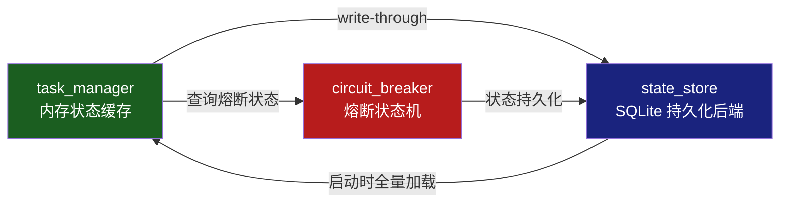
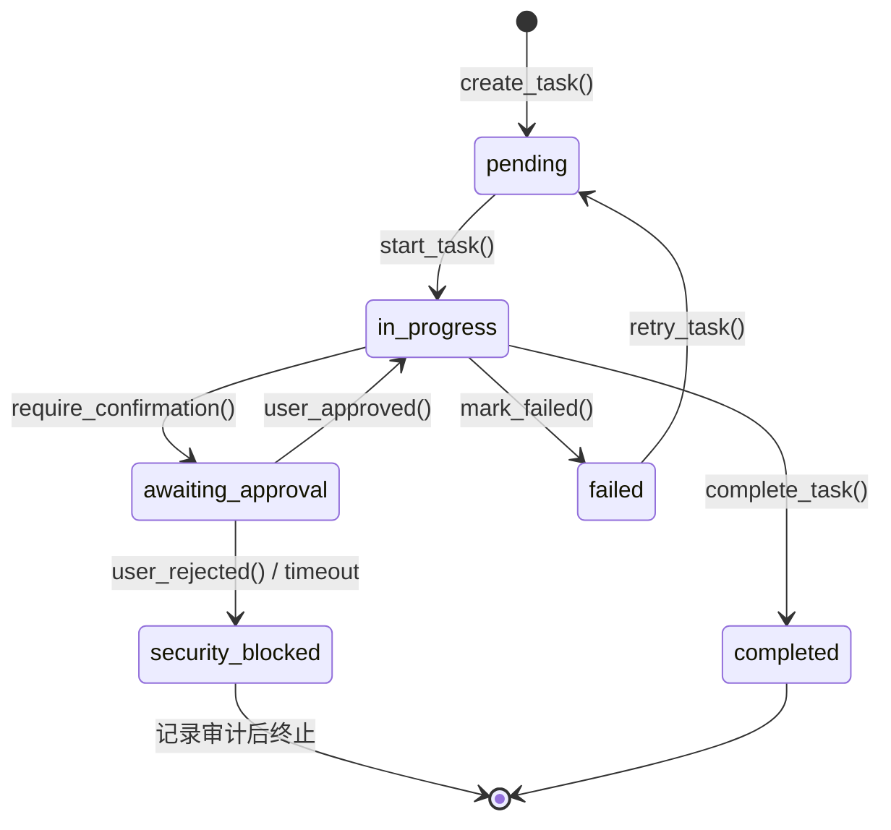
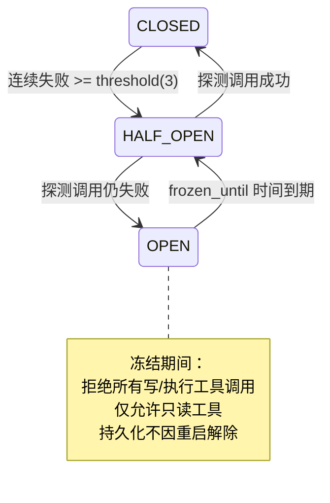

# DOC-2：状态管理与韧性层技术实现方案

> 覆盖模块：M1 `state_store` · M2 `task_manager` · M6 `circuit_breaker`  
> 核心目标：**进程重启后状态完全恢复，连续故障自动熔断，防止雪崩**

---

## 模块关系总览



---

## M1：状态持久化层 `managers/state_store.py`

### 职责

为所有需要跨进程存活的状态提供统一持久化接口。Agent 重启后，`task_manager` 和 `circuit_breaker` 从此处完整恢复上一次的运行状态。

### 数据库 Schema

```sql
-- 任务表：对应 TaskManager 的每一个 TodoItem
CREATE TABLE IF NOT EXISTS tasks (
    id          TEXT    PRIMARY KEY,
    title       TEXT    NOT NULL,
    status      TEXT    NOT NULL DEFAULT 'pending',
    risk_level  TEXT,
    op_id       TEXT,
    blocked_by  TEXT,              -- JSON: ["task_id_1", "task_id_2"]
    created_at  REAL    NOT NULL,
    updated_at  REAL    NOT NULL
);

-- 熔断状态表：每模块一行
CREATE TABLE IF NOT EXISTS circuit_state (
    module       TEXT    PRIMARY KEY,
    state        TEXT    NOT NULL DEFAULT 'CLOSED',
    fail_count   INTEGER NOT NULL DEFAULT 0,
    frozen_until REAL    DEFAULT NULL
);

-- 操作审计索引表（轻量，详情在 JSONL 审计文件）
CREATE TABLE IF NOT EXISTS op_index (
    op_id      TEXT    PRIMARY KEY,
    phase      TEXT    NOT NULL,
    summary    TEXT,
    ts         REAL    NOT NULL
);

-- 快照元数据（与 snapshot.py 配合）
CREATE TABLE IF NOT EXISTS snapshots (
    op_id      TEXT    PRIMARY KEY,
    snap_path  TEXT    NOT NULL,
    created_at REAL    NOT NULL,
    expires_at REAL    NOT NULL    -- 默认 24 小时后过期
);
```

### 关键接口签名

```python
import sqlite3
from contextlib import contextmanager
from dataclasses import dataclass
from typing import Generator, Literal

@dataclass
class TaskRow:
    id:         str
    title:      str
    status:     str
    risk_level: str | None
    op_id:      str | None
    blocked_by: list[str]
    created_at: float
    updated_at: float

@dataclass
class CircuitRow:
    module:       str
    state:        Literal["CLOSED", "HALF_OPEN", "OPEN"]
    fail_count:   int
    frozen_until: float | None

class StateStore:
    def __init__(self, db_path: str = "ops_agent.db") -> None:
        self._db_path = db_path
        self._init_schema()

    @contextmanager
    def _conn(self) -> Generator[sqlite3.Connection, None, None]:
        """带 WAL 模式的连接上下文管理器"""

    # ── Tasks ──────────────────────────────────────
    def upsert_task(self, task: TaskRow) -> None:
        """write-through：内存写完后立即调用此方法"""

    def load_all_tasks(self) -> list[TaskRow]:
        """启动时调用，全量加载到 task_manager 内存"""

    def delete_task(self, task_id: str) -> None: ...

    # ── Circuit Breaker ────────────────────────────
    def get_circuit(self, module: str) -> CircuitRow:
        """不存在则返回默认 CLOSED 状态"""

    def save_circuit(self, row: CircuitRow) -> None: ...

    # ── Snapshots ──────────────────────────────────
    def register_snapshot(self, op_id: str, snap_path: str, ttl: float = 86400) -> None: ...
    def get_snapshot(self, op_id: str) -> str | None:
        """返回 snap_path，已过期或不存在返回 None"""
    def purge_expired_snapshots(self) -> int:
        """清理过期快照，返回清理数量"""
```

### 关键算法伪代码

```
function upsert_task(task):
    with _conn() as conn:
        conn.execute("""
            INSERT INTO tasks VALUES (?,?,?,?,?,?,?,?)
            ON CONFLICT(id) DO UPDATE SET
                status     = excluded.status,
                risk_level = excluded.risk_level,
                op_id      = excluded.op_id,
                blocked_by = excluded.blocked_by,
                updated_at = excluded.updated_at
        """, (task.id, task.title, task.status, task.risk_level,
              task.op_id, json.dumps(task.blocked_by),
              task.created_at, task.updated_at))
        conn.commit()

function load_all_tasks():
    with _conn() as conn:
        rows = conn.execute("SELECT * FROM tasks ORDER BY created_at").fetchall()
    return [row_to_task(r) for r in rows]
```

> **WAL 模式**：`PRAGMA journal_mode=WAL` — 读写不互相阻塞，适合后台监控线程频繁读取。

### 异常处理与安全边界

| 失效场景 | 应对策略 |
|---------|---------|
| SQLite 文件损坏 | 启动时 `PRAGMA integrity_check`；损坏则备份后重建（任务状态丢失但不崩溃）|
| 磁盘满写入失败 | 捕获 `sqlite3.OperationalError`，降级为内存模式并告警 |
| 并发写（多线程）| `_conn()` 使用 `check_same_thread=False` + 外层锁保护 |

---

## M2：任务状态机 `managers/task_manager.py`

### 职责

实现 s03（TodoWrite）+ s12（Task System）的运维增强版。

> **关键区分（来自 s13a）**：本模块管理两种完全不同的"任务"，不能混用：
>
> | 类型 | 对应类 | 存在哪里 | 管什么 |
> |------|--------|---------|--------|
> | 工作图任务 | `TaskRecord` | SQLite `tasks` 表（持久化）| 工作目标、依赖、认领状态 |
> | 运行时任务 | `RuntimeTaskState` | 内存 `RuntimeTaskManager`（运行时）| 当前执行槽位、输出文件、通知状态 |
>
> 一个工作图任务可以派生多个运行时任务（如：后台跑测试 + 启动子 Agent）。

### 状态机定义



### 关键接口签名

```python
from dataclasses import dataclass, field
from enum import Enum
from typing import Literal

class TaskStatus(str, Enum):
    PENDING            = "pending"
    IN_PROGRESS        = "in_progress"
    AWAITING_APPROVAL  = "awaiting_approval"
    SECURITY_BLOCKED   = "security_blocked"
    COMPLETED          = "completed"
    FAILED             = "failed"

# ── 工作图任务（持久化，对应 s12 TaskRecord）──────────────────
@dataclass
class TaskRecord:
    """磁盘上的工作目标节点，跨会话存活"""
    id:         str
    title:      str
    status:     TaskStatus = TaskStatus.PENDING
    risk_level: str        = "LOW"
    op_id:      str        = ""
    blocked_by: list[str]  = field(default_factory=list)  # 依赖的任务 ID
    owner:      str        = ""                            # 认领者
    created_at: float      = 0.0
    updated_at: float      = 0.0

# ── 运行时任务（内存，对应 s13 RuntimeTaskState）──────────────
@dataclass
class RuntimeTaskState:
    """当前活着的执行槽位，进程退出即消失"""
    id:              str
    type:            Literal["local_bash", "local_agent", "monitor"]
    status:          Literal["running", "completed", "failed", "killed"]
    description:     str
    work_graph_id:   str | None  # 关联的工作图任务 ID（可选）
    start_time:      float
    end_time:        float | None = None
    output_file:     str | None   = None  # 大输出写磁盘
    notified:        bool         = False  # 结果是否已回通知系统

class TaskManager:
    def __init__(self, store: "StateStore") -> None:
        self._tasks:    dict[str, TaskRecord]       # 工作图任务（内存缓存）
        self._runtime:  dict[str, RuntimeTaskState] # 运行时任务（纯内存）
        self._store:    StateStore
        self._lock:     asyncio.Lock

    # ── 工作图任务操作 ──────────────────────────────────────────
    async def create_task(self, title: str, risk: str = "LOW") -> TaskRecord: ...
    async def start_task(self, task_id: str, op_id: str) -> None: ...
    async def require_confirmation(self, task_id: str) -> None: ...
    async def approve_task(self, task_id: str) -> None: ...
    async def reject_task(self, task_id: str) -> None: ...
    async def complete_task(self, task_id: str) -> None: ...
    async def mark_failed(self, task_id: str, reason: str) -> None: ...

    def get_active(self) -> TaskRecord | None:
        """返回当前 in_progress 的工作图任务（至多一个）"""

    def summary(self) -> str:
        """返回 markdown 格式的任务状态摘要，注入 system prompt"""

    # ── 运行时任务操作 ──────────────────────────────────────────
    def spawn_runtime(
        self,
        task_type:     str,
        description:   str,
        work_graph_id: str | None = None,
    ) -> RuntimeTaskState: ...

    def complete_runtime(self, runtime_id: str, output_file: str | None = None) -> None: ...
    def list_running(self) -> list[RuntimeTaskState]: ...

    def _persist(self, task: TaskRecord) -> None:
        """write-through 到 state_store（仅工作图任务，运行时任务不持久化）"""
```

### 关键算法伪代码

```
function _transition(task_id, from_states, to_state):
    """通用状态转换，带状态合法性校验"""
    task = _tasks[task_id]
    if task.status not in from_states:
        raise InvalidTransitionError(
            f"任务 {task_id} 当前状态 {task.status}，"
            f"无法转换为 {to_state}"
        )
    task.status     = to_state
    task.updated_at = now()
    _persist(task)           # 立即写 SQLite

async function start_task(task_id, op_id):
    async with _lock:
        active = get_active()
        if active and active.id != task_id:
            raise ConcurrentTaskError("已有任务进行中，不可并发")
        task       = _tasks[task_id]
        task.op_id = op_id
        _transition(task_id, [PENDING], IN_PROGRESS)

async function require_confirmation(task_id):
    # 挂起主循环：将状态改为 awaiting_approval
    # agent_loop 检测到此状态后暂停 LLM 调用，等待 CLI 输入
    _transition(task_id, [IN_PROGRESS], AWAITING_APPROVAL)
```

---

## M6：熔断器 `core/circuit_breaker.py`

### 职责

防止 Agent 在连续故障时雪崩式失控。**状态持久化到 SQLite**，重启不自动恢复（防止攻击者通过强制重启绕过熔断）。

### 状态机



### 关键接口签名

```python
import time
from dataclasses import dataclass
from typing import Literal, TypeVar, Callable, Awaitable

T = TypeVar("T")

class CircuitBreakerError(Exception):
    """熔断开路，操作被拒绝"""

@dataclass
class CircuitState:
    module:       str
    state:        Literal["CLOSED", "HALF_OPEN", "OPEN"] = "CLOSED"
    fail_count:   int   = 0
    frozen_until: float = 0.0

class CircuitBreaker:
    FAIL_THRESHOLD   = 3      # 连续失败次数阈值
    FREEZE_SECONDS   = 600    # 熔断持续时间（10 分钟）
    PROBE_RESET      = 5      # HALF_OPEN 连续成功次数重置到 CLOSED

    def __init__(self, module: str, store: "StateStore") -> None:
        self._module = module
        self._store  = store
        self._state  = store.get_circuit(module)

    def is_open(self) -> bool:
        """是否处于熔断状态（OPEN 且未到期）"""

    def record_success(self) -> None:
        """记录成功调用，可能触发 OPEN→HALF_OPEN→CLOSED"""

    def record_failure(self) -> None:
        """记录失败调用，可能触发 CLOSED→HALF_OPEN→OPEN"""

    async def call(
        self,
        fn:   Callable[[], Awaitable[T]],
        *,
        allow_read: bool = False,   # 熔断时是否允许只读操作通过
    ) -> T:
        """装饰器用法：受熔断保护的调用"""
```

### 关键算法伪代码

```
function record_failure():
    _state.fail_count += 1

    if _state.state == CLOSED and _state.fail_count >= FAIL_THRESHOLD:
        _state.state        = HALF_OPEN
        log.warning("进入 HALF_OPEN 警戒状态")

    if _state.state == HALF_OPEN:
        _state.state        = OPEN
        _state.frozen_until = now() + FREEZE_SECONDS
        log.critical("熔断器 OPEN，冻结 10 分钟")
        # 向 audit_logger 写入 CRITICAL 级别事件

    _persist()   # 立即写 SQLite，重启不解除

function record_success():
    if _state.state == HALF_OPEN:
        probe_success_count += 1
        if probe_success_count >= PROBE_RESET:
            _state.state      = CLOSED
            _state.fail_count = 0
            log.info("熔断器恢复 CLOSED")
    elif _state.state == CLOSED:
        _state.fail_count = max(0, _state.fail_count - 1)  # 成功时小幅衰减
    _persist()

async function call(fn, allow_read=False):
    # 检查是否到期（OPEN → HALF_OPEN）
    if _state.state == OPEN:
        if now() > _state.frozen_until:
            _state.state = HALF_OPEN
            _persist()
        elif not allow_read:
            raise CircuitBreakerError(
                f"熔断器 OPEN，拒绝操作，解冻时间: "
                f"{datetime.fromtimestamp(_state.frozen_until)}"
            )

    try:
        result = await fn()
        record_success()
        return result
    except Exception as e:
        record_failure()
        raise
```

### 异常处理与安全边界

| 失效场景 | 应对策略 |
|---------|---------|
| 攻击者强制重启进程绕过 OPEN | SQLite 持久化熔断状态，重启后读取并恢复，**不自动解除** |
| `frozen_until` 被篡改 | SQLite 文件权限设为 600（仅 ops-agent 账号可读写）|
| 熔断器本身抛出异常 | `agent_loop` 捕获后**默认拒绝操作**（失效安全原则）|
