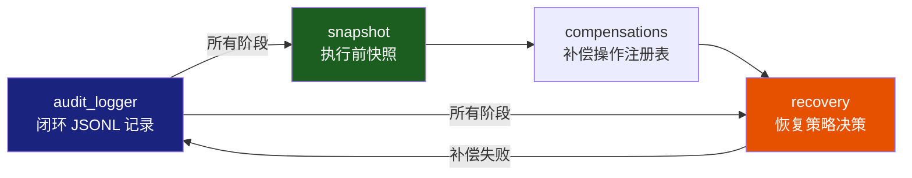
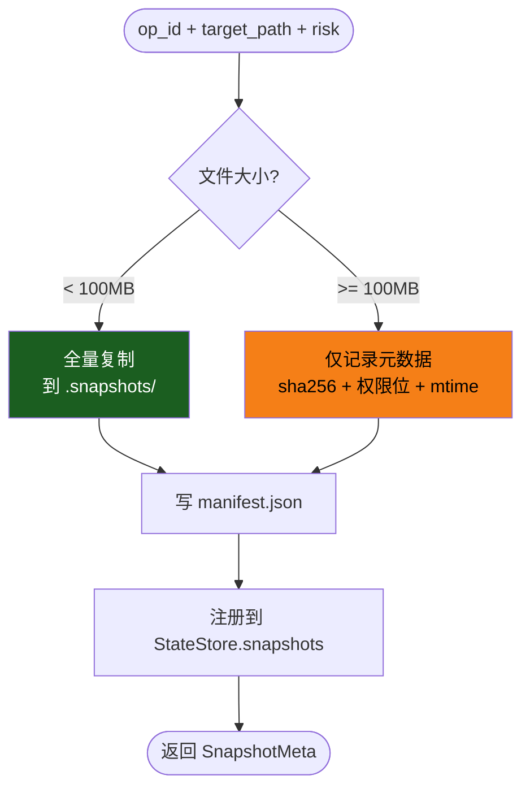
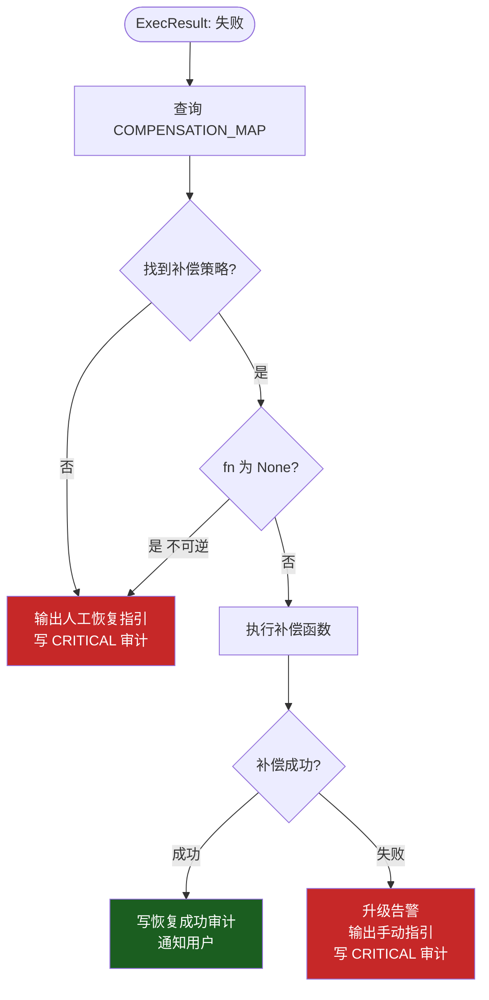

# DOC-3：回滚补偿与审计溯源层技术实现方案

> 覆盖模块：M5 `snapshot` + `compensations` + `recovery` · M8 `audit_logger`  
> 核心目标：**操作可回溯、失败可恢复、全程留证**

---

## 模块关系



---

## M5：回滚补偿层

### 职责

在**高风险操作执行前**自动创建快照；执行失败后根据补偿注册表选择恢复策略；补偿失败时输出手动恢复指引。

### 5.1 快照模块 `rollback/snapshot.py`

#### 快照策略决策



#### 关键接口

```python
import hashlib
import shutil
from dataclasses import dataclass
from pathlib import Path

@dataclass
class SnapshotMeta:
    op_id:       str
    snap_dir:    str          # .snapshots/<op_id>_<ts>/
    target_path: str          # 被操作的目标文件/目录
    file_size:   int          # 字节
    sha256:      str          # 内容 hash（用于完整性验证）
    permissions: int          # stat.st_mode
    owner_uid:   int
    owner_gid:   int
    is_full_copy: bool        # True=全量复制, False=仅元数据
    created_at:  float
    expires_at:  float        # 默认 created_at + 86400

class Snapshot:
    SNAP_ROOT    = Path(".snapshots")
    SIZE_LIMIT   = 100 * 1024 * 1024   # 100MB

    def __init__(self, store: "StateStore") -> None: ...

    async def take(self, op_id: str, target_path: str) -> SnapshotMeta:
        """执行前调用，返回快照元数据"""

    async def restore(self, meta: SnapshotMeta) -> bool:
        """从快照恢复，返回是否成功"""

    def get(self, op_id: str) -> SnapshotMeta | None: ...

    def purge_expired(self) -> int:
        """清理过期快照，返回清理数量"""
```

#### 关键算法伪代码

```
async function take(op_id, target_path):
    path   = Path(target_path)
    stat   = path.stat()
    sha256 = compute_sha256(path)      # 流式读取，避免内存溢出

    snap_dir = SNAP_ROOT / f"{op_id}_{int(now())}"
    snap_dir.mkdir(parents=True)

    is_full = stat.st_size < SIZE_LIMIT

    if is_full:
        shutil.copy2(path, snap_dir / path.name)
    # 无论如何都写 manifest
    manifest = {
        "op_id":        op_id,
        "target_path":  str(path),
        "sha256":       sha256,
        "permissions":  stat.st_mode,
        "owner_uid":    stat.st_uid,
        "owner_gid":    stat.st_gid,
        "is_full_copy": is_full,
        "created_at":   now(),
        "expires_at":   now() + 86400,
    }
    write_json(snap_dir / "manifest.json", manifest)

    meta = SnapshotMeta(**manifest, snap_dir=str(snap_dir))
    store.register_snapshot(op_id, str(snap_dir))
    return meta

async function restore(meta):
    if not meta.is_full_copy:
        log.warning("大文件仅有元数据快照，无法自动恢复，输出手动指引")
        return False

    backup = Path(meta.snap_dir) / Path(meta.target_path).name
    # 完整性校验
    if compute_sha256(backup) != meta.sha256:
        log.error("快照文件 hash 不匹配，拒绝恢复（可能被篡改）")
        return False

    shutil.copy2(backup, meta.target_path)
    # 恢复权限和 owner
    os.chmod(meta.target_path, meta.permissions)
    os.chown(meta.target_path, meta.owner_uid, meta.owner_gid)
    return True
```

### 5.2 补偿操作注册表 `rollback/compensations.py`

#### 三级补偿体系

```python
from dataclasses import dataclass
from typing import Callable, Literal, Awaitable

CompensateFunc = Callable[["ExecResult", "SnapshotMeta"], Awaitable[bool]]

@dataclass
class Compensation:
    level:       Literal["L1", "L2", "L3"]
    fn:          CompensateFunc | None   # None = 不可逆，无自动补偿
    description: str
    manual_hint: str                     # 补偿失败时的手动恢复提示

COMPENSATION_MAP: dict[str, Compensation] = {
    # L1：文件级恢复
    "rm":     Compensation("L1", _restore_from_snapshot,
                           "从快照恢复被删除文件",
                           "cp .snapshots/<op_id>/<filename> <original_path>"),

    # L2：配置级恢复
    "chmod":  Compensation("L2", _restore_permissions,
                           "恢复原始权限位",
                           "chmod <original_mode> <path>"),
    "chown":  Compensation("L2", _restore_ownership,
                           "恢复原始属主",
                           "chown <uid>:<gid> <path>"),
    ">":      Compensation("L2", _restore_from_snapshot,
                           "恢复被覆写的文件",
                           "cp .snapshots/<op_id>/<filename> <path>"),

    # L3：服务级恢复
    "systemctl stop":    Compensation("L3", _restart_service,
                                      "重启被停止的服务",
                                      "systemctl start <service>"),
    "systemctl disable": Compensation("L3", _reenable_service,
                                      "重新启用服务",
                                      "systemctl enable <service>"),

    # 不可逆操作（无自动补偿）
    "kill":   Compensation("L3", None,
                           "进程终止不可逆",
                           "需手动排查进程是否需要重启"),
}
```

### 5.3 恢复策略 `rollback/recovery.py`

#### 恢复决策流程



#### 关键接口

```python
class Recovery:
    def __init__(
        self,
        comp_map:  dict[str, Compensation],
        snapshot:  Snapshot,
        auditor:   "AuditLogger",
    ) -> None: ...

    async def attempt(
        self,
        result:    "ExecResult",
        meta:      "SnapshotMeta",
        cmd:       str,
    ) -> bool:
        """尝试自动恢复，返回是否成功"""

    def _manual_hint(self, meta: "SnapshotMeta", cmd: str) -> str:
        """生成手动恢复指引字符串"""
```

#### 关键算法伪代码

```
async function attempt(result, meta, cmd):
    cmd_key = extract_cmd_key(cmd)     # "rm -rf foo" → "rm"

    comp = COMPENSATION_MAP.get(cmd_key)
    if comp is None or comp.fn is None:
        hint = _manual_hint(meta, cmd)
        auditor.log(phase="recovery", verdict="manual_required", hint=hint)
        print(f"⚠ 操作不可自动恢复，请手动执行：\n{hint}")
        return False

    try:
        success = await comp.fn(result, meta)
        if success:
            auditor.log(phase="recovery", verdict="success", level=comp.level)
            return True
        else:
            raise RuntimeError("补偿函数返回 False")
    except Exception as e:
        hint = _manual_hint(meta, cmd)
        auditor.log(phase="recovery", verdict="failed",
                    error=str(e), hint=hint, severity="CRITICAL")
        print(f"❌ 自动恢复失败，请立即手动执行：\n{hint}")
        return False
```

### 异常处理与安全边界

| 失效场景 | 应对策略 |
|---------|---------|
| 快照目录磁盘满 | `take()` 失败时**阻止原操作执行**（无快照不执行高风险操作）|
| 快照文件被篡改 | hash 校验不匹配时拒绝恢复，输出告警 |
| 补偿操作再次失败 | 记录 CRITICAL 审计，输出人工指引，**不再重试**（避免死循环）|

---

## M8：审计日志 `managers/audit_logger.py`

### 职责

以 **JSONL（JSON Lines）** 格式记录从指令接收到结果输出的**完整推理链路**，支持异常后全程溯源。DeepSeek/Qwen3 的 `<think>` 内容直接写入，天然对应推理溯源。

### JSONL 事件规范

每行一个 JSON 对象，8 个标准 `phase`：

```
receive → perceive → reason → validate → snapshot → confirm → execute → complete
                                                              ↘ recovery（异常时）
```

**完整事件示例**（以"清理日志"为例）：

```jsonl
{"ts":"2026-01-01T10:00:01Z","session":"s_abc","op_id":null,"phase":"receive","data":{"raw_input":"帮我清理系统垃圾","injection_detected":false,"intent_risk":"MEDIUM","intent_classifier":"rule"}}
{"ts":"2026-01-01T10:00:02Z","session":"s_abc","op_id":null,"phase":"perceive","data":{"tool":"disk_monitor","top_files":[{"path":"/var/log/mysql/slow.log","size_mb":47000}]}}
{"ts":"2026-01-01T10:00:04Z","session":"s_abc","op_id":null,"phase":"reason","data":{"model":"deepseek-r1","think":"用户要清理垃圾...发现 47GB 日志...计划删除...","tool_call":{"name":"rm","args":{"path":"/var/log/mysql/slow.log"}}}}
{"ts":"2026-01-01T10:00:04Z","session":"s_abc","op_id":"op_x1","phase":"validate","data":{"verdict":"HIGH","reasons":["数据库日志路径"],"validator":"CommandValidator"}}
{"ts":"2026-01-01T10:00:04Z","session":"s_abc","op_id":"op_x1","phase":"snapshot","data":{"snap_path":".snapshots/op_x1_1735689604","size_mb":47000,"is_full_copy":false,"sha256":"a3f..."}}
{"ts":"2026-01-01T10:00:12Z","session":"s_abc","op_id":"op_x1","phase":"confirm","data":{"method":"cli","verdict":"approved","user_response":"y","wait_seconds":8}}
{"ts":"2026-01-01T10:00:12Z","session":"s_abc","op_id":"op_x1","phase":"execute","data":{"cmd":"rm /var/log/mysql/slow.log","privilege":"ops-writer","uid":9002,"exit_code":0,"duration_ms":134}}
{"ts":"2026-01-01T10:00:13Z","session":"s_abc","op_id":"op_x1","phase":"complete","data":{"status":"success","bytes_freed":49283072000,"task_id":"t_001"}}
```

### 关键接口签名

```python
import json
import time
from pathlib import Path
from typing import Any, Literal

Phase = Literal[
    "receive", "perceive", "reason", "validate",
    "snapshot", "confirm", "execute", "complete", "recovery"
]

class AuditLogger:
    def __init__(
        self,
        audit_dir:  str  = ".audit",
        session_id: str  = "",
    ) -> None:
        self._session = session_id or generate_session_id()
        self._path    = Path(audit_dir) / f"session_{self._session}.jsonl"
        self._path.parent.mkdir(exist_ok=True)

    def log(
        self,
        phase:  Phase,
        data:   dict[str, Any],
        op_id:  str | None = None,
        level:  Literal["INFO", "WARN", "ERROR", "CRITICAL"] = "INFO",
    ) -> None:
        """同步写入，线程安全"""

    def log_receive(self, raw_input: str, injection: bool, risk: str) -> None: ...
    def log_perceive(self, tool: str, result: dict) -> None: ...
    def log_reason(self, model: str, think: str, tool_call: dict) -> None: ...
    def log_validate(self, op_id: str, verdict: str, reasons: list[str]) -> None: ...
    def log_snapshot(self, op_id: str, meta: "SnapshotMeta") -> None: ...
    def log_confirm(self, op_id: str, verdict: str, wait_sec: float) -> None: ...
    def log_execute(self, op_id: str, result: "ExecResult") -> None: ...
    def log_complete(self, op_id: str, status: str, extra: dict) -> None: ...
    def log_recovery(self, op_id: str, verdict: str, hint: str = "") -> None: ...

    def tail(self, n: int = 20) -> list[dict]:
        """返回最后 n 条日志，用于 context 注入"""
```

### 关键算法伪代码

```
function log(phase, data, op_id, level):
    entry = {
        "ts":      utcnow_iso(),
        "session": _session,
        "op_id":   op_id,
        "level":   level,
        "phase":   phase,
        "data":    data,
    }
    line = json.dumps(entry, ensure_ascii=False)

    # 线程安全追加写入
    with _file_lock:
        with open(_path, "a", encoding="utf-8") as f:
            f.write(line + "\n")
            f.flush()              # 立即刷盘，防止崩溃丢失
```

### 异常处理与安全边界

| 失效场景 | 应对策略 |
|---------|---------|
| 日志磁盘满 | 捕获 `OSError`，降级为内存缓存（最多 1000 条），不因日志失败中断操作 |
| 日志文件被篡改 | 按 session 独立文件 + 文件创建时记录初始 hash（可选）|
| `<think>` 内容过大 | 截断到前 4096 字符，完整内容写单独文件 `.audit/think_<op_id>.txt` |
