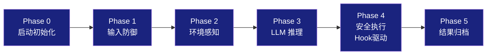
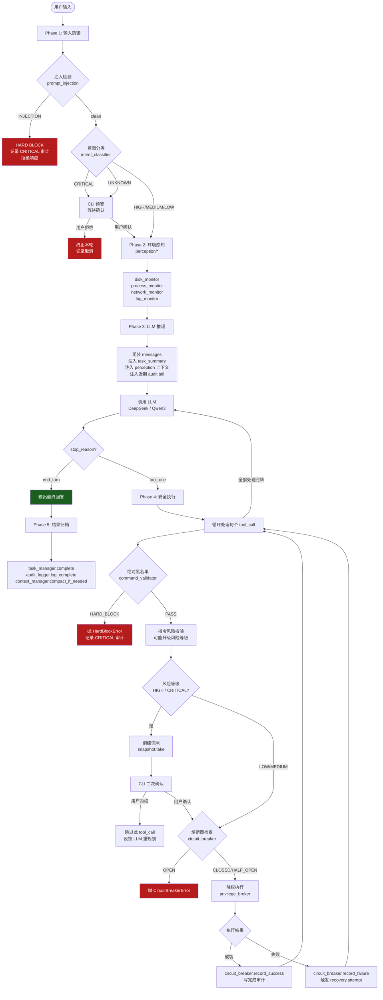
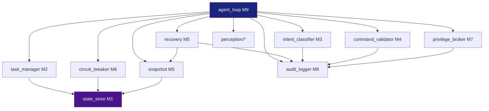

# DOC-4：主循环编排层 + 完整生命周期时序图 + 项目目录结构（v2.0）

> 覆盖模块：M9 `core/agent_loop.py`（串联全部模块）  
> **v2.0 变更**：引入 HookManager（s08）；主循环变薄，安全逻辑通过 Hook 外置；新增 MemoryManager / CronScheduler / ErrorRecovery 集成点

---

## M9：Agent 主循环 `core/agent_loop.py`（v2.0）

### 职责

主循环是 Agent 的**中枢神经**，负责按正确顺序编排所有模块。  
v2.0 核心原则：**主循环薄，安全逻辑外置**——Hook 调用替代硬编码安全检查，主循环只做编排。

### 六阶段执行模型（v2.0）



### 主循环核心流程图



### 关键接口签名

```python
import asyncio
from dataclasses import dataclass, field
from typing import Literal

@dataclass
class AgentConfig:
    model_id:       str = "deepseek-chat"       # R1 不支持 function calling
    base_url:       str = "https://api.deepseek.com/v1"
    api_key:        str = ""
    db_path:        str = "ops_agent.db"
    audit_dir:      str = ".audit"
    snap_root:      str = ".snapshots"
    max_turns:      int = 20
    context_limit:  int = 120_000

# ── QueryState（来自 s00a/s00c）────────────────────────────────
# 跨轮变化的流程控制状态，不是对话内容
@dataclass
class LoopState:
    """主循环运行时状态，对应 s00a QueryState"""
    messages:               list[dict]         # LLM 对话历史（内容状态）
    session_id:             str
    # ── 流程控制状态（不要塞进 messages）──────────────────────
    turn_count:             int   = 0
    continuation_count:     int   = 0          # 续写次数（max_tokens 恢复）
    has_attempted_compact:  bool  = False       # 是否已做过压缩
    transition_reason:      str | None = None  # 上一轮为什么继续
    permission_mode:        str   = "default"  # default / plan / auto
    stop_hook_active:       bool  = False

# TransitionReason 枚举（来自 s00c）
TRANSITIONS = (
    "tool_result_continuation",   # 正常：工具执行完，继续推理
    "max_tokens_recovery",        # 恢复：输出截断，注入续写消息
    "compact_retry",              # 恢复：上下文压缩后重试
    "transport_retry",            # 恢复：网络抖动退避后重试
    "stop_hook_continuation",     # 控制：hook 要求本轮不结束
)

# ── ToolUseContext（来自 s02a）──────────────────────────────────
# 工具执行时的共享上下文总线，不只是 tool_input
@dataclass
class ToolUseContext:
    """工具控制平面的共享环境，所有工具通过此总线访问运行时状态"""
    handlers:           dict                   # tool_name → handler
    permission_mgr:     "PermissionManager"
    hook_mgr:           "HookManager"
    broker:             "PrivilegeBroker"
    auditor:            "AuditLogger"
    snapshot:           "Snapshot"
    breaker:            "CircuitBreaker"
    messages:           list[dict]             # 当前对话历史（只读引用）
    notifications:      list[str]              # hook exit 2 注入的消息
    cwd:                str = "."

class AgentLoop:
    def __init__(self, config: AgentConfig) -> None:
        self.store:       StateStore
        self.tasks:       TaskManager
        self.auditor:     AuditLogger
        self.injection:   PromptInjectionDetector
        self.intent:      IntentClassifier
        self.perm_mgr:    PermissionManager
        self.hook_mgr:    HookManager
        self.snapshot:    Snapshot
        self.recovery:    Recovery
        self.broker:      PrivilegeBroker
        self.breaker:     CircuitBreaker
        self.perception:  PerceptionAggregator
        self.context_mgr: ContextManager
        self.memory:      MemoryManager
        self.cron:        CronScheduler
        self.prompt_builder: SystemPromptBuilder

    def _build_tool_use_context(self, state: LoopState) -> ToolUseContext:
        """每轮构建工具执行上下文总线"""

    async def run(self) -> None:
        """启动 REPL 主循环"""

    async def _handle_message(self, user_input: str, state: LoopState) -> str:
        """处理单条用户输入，返回最终回答"""

    async def _phase1_defend(self, user_input: str, state: LoopState) -> "IntentResult":
        """注入检测 + 意图分类 + 预确认"""

    async def _phase2_perceive(self, state: LoopState) -> dict:
        """OS 环境感知，返回结构化上下文"""

    async def _phase3_reason(self, state: LoopState, perception: dict) -> "LLMResponse":
        """调用 LLM，内含 ErrorRecovery 三策略"""

    async def _phase4_execute(self, tool_calls: list[dict], ctx: ToolUseContext) -> list[dict]:
        """处理所有 tool_call，返回工具结果列表"""

    async def _handle_single_tool(self, tool_call: dict, ctx: ToolUseContext) -> dict:
        """单个 tool_call 的完整安全管道（Hook → Permission → Broker）"""

    async def _phase5_archive(self, state: LoopState, answer: str) -> None:
        """完成归档：任务状态 + 上下文压缩"""

    async def _cli_confirm(self, tool_call: dict, risk: str, snap_meta: "SnapshotMeta | None") -> bool:
        """CLI 二次确认，阻塞等待用户输入"""
```
    ) -> bool:
        """CLI 二次确认，阻塞等待用户输入"""
```

### 关键算法伪代码（v2.0 Hook 驱动）

```
async function _handle_single_tool(tool_call, ctx):
    cmd   = tool_call.name
    args  = tool_call.args
    op_id = generate_op_id()

    # ── PreToolUse Hooks（外置安全逻辑）────────────────────
    pre = await hooks.run_hooks("PreToolUse", {
        "tool_name":  cmd,
        "tool_input": args,
    })

    # 注入 hook 消息（exit 2：快照通知、风险升级警告）
    for msg in pre.messages:
        ctx.messages.append({"role": "user", "content": f"[Hook]: {msg}"})

    # Hook 阻断（exit 1：黑名单/注入检测）
    if pre.blocked:
        auditor.log("validate", {"verdict": "HOOK_BLOCK", "reason": pre.block_reason})
        return tool_error_result(op_id, f"Hook阻断: {pre.block_reason}")

    # ── PermissionManager 决策（s07）────────────────────────
    # hook 可通过 permissionDecision 字段覆盖
    if pre.permission_override:
        decision_behavior = pre.permission_override
    else:
        decision = perm_mgr.check(cmd, args)
        decision_behavior = decision.behavior

    if decision_behavior == "deny":
        return tool_error_result(op_id, f"权限拒绝: {decision.reason}")

    if decision_behavior == "ask":
        confirmed = await _cli_confirm(tool_call, decision)
        auditor.log_confirm(op_id, "approved" if confirmed else "rejected")
        if not confirmed:
            return tool_skip_result(op_id, "用户取消")

    # ── CircuitBreaker 检查──────────────────────────────────
    if breaker.is_open():
        raise CircuitBreakerError("熔断器 OPEN，拒绝写操作")

    # ── 降权执行（M7）───────────────────────────────────────
    exec_result = await breaker.call(
        lambda: broker.execute(cmd, args, decision.behavior, op_id)
    )

    # ── PostToolUse Hooks（审计 + 熔断检查）─────────────────
    post = await hooks.run_hooks("PostToolUse", {
        "tool_name":   cmd,
        "tool_input":  args,
        "tool_output": exec_result.stdout,
    })
    # post hooks 中的 circuit_check.py 负责记录失败计数

    # ── 失败处理 + 回滚───────────────────────────────────────
    if not exec_result.success:
        snap = snapshot.get(op_id)
        if snap:
            await recovery.attempt(exec_result, snap, cmd)
        return tool_error_result(op_id, exec_result.stderr)

    return tool_success_result(op_id, exec_result.stdout)

async function run():
    # Phase 0: 启动初始化
    store.integrity_check()
    tasks.load_from_store()
    breaker.restore_from_store()
    memory.load_all()              # [s09] 加载跨 Session 记忆
    cron.start()                   # [s14] 启动 Cron 后台线程
    hooks.run_hooks("SessionStart") # [s08] Session 启动 hook

    ctx = LoopContext(messages=[], session_id=generate_id())

    while True:
        # Cron 通知注入（[s14]）
        for note in cron.drain_notifications():
            ctx.messages.append({"role": "user", "content": note})

        user_input = await async_input("> ")
        if user_input == "exit": break
        if user_input.startswith("/mode"):
            perm_mgr.switch_mode(user_input.split()[1]); continue
        if user_input == "/status":
            print(tasks.summary()); continue

        try:
            answer = await _handle_message(user_input, ctx)
            print(answer)
        except InjectionError as e:
            print(f"⛔ {e}")
        except CircuitBreakerError as e:
            print(f"🔴 熔断: {e}")
        except UserCancelError:
            print("已取消")

        # ErrorRecovery 在 _phase3_reason 内处理（s11）
```

---

## 完整生命周期时序图

> 场景：管理员输入"帮我清理系统垃圾"

```mermaid
sequenceDiagram
    actor Admin as 管理员
    participant Loop as AgentLoop (M9)
    participant Inj as PromptInjectionDetector
    participant IC as IntentClassifier (M3)
    participant PM as PerceptionAggregator
    participant LLM as LLM (DeepSeek/Qwen3)
    participant CV as CommandValidator (M4)
    participant SN as Snapshot (M5)
    participant TM as TaskManager (M2)
    participant CB as CircuitBreaker (M6)
    participant PB as PrivilegeBroker (M7)
    participant RC as Recovery (M5)
    participant AL as AuditLogger (M8)
    participant SS as StateStore (M1)

    Note over Admin,SS: ═══ Phase 1: 输入防御 ═══

    Admin->>Loop: "帮我清理系统垃圾"
    Loop->>Inj: detect(input)
    Inj-->>Loop: clean (无注入)
    Loop->>IC: aclassify(input)
    IC->>IC: 规则引擎匹配
    IC-->>Loop: IntentResult(risk=MEDIUM, classifier=rule)
    Loop->>AL: log_receive(input, injection=false, risk=MEDIUM)
    AL->>SS: 写 JSONL

    Note over Admin,SS: ═══ Phase 2: 环境感知 ═══

    Loop->>PM: gather_all()
    PM->>PM: disk_monitor.top_files()
    PM->>PM: process_monitor.snapshot()
    PM-->>Loop: {top_files: [{/var/log/mysql/slow.log: 47GB}], ...}
    Loop->>AL: log_perceive(tool=disk_monitor, result)

    Note over Admin,SS: ═══ Phase 3: LLM 推理 ═══

    Loop->>TM: create_task("清理磁盘空间")
    TM->>SS: upsert_task(status=pending)
    Loop->>Loop: 组装 messages (system+context+perception+task_summary)
    Loop->>LLM: chat.completions.create(messages, tools)
    LLM-->>Loop: tool_call(rm, {path: /var/log/mysql/slow.log})
    Loop->>AL: log_reason(model, think_content, tool_call)

    Note over Admin,SS: ═══ Phase 4: 安全执行 ═══

    Loop->>TM: start_task(task_id, op_id)
    TM->>SS: upsert_task(status=in_progress)

    Loop->>CV: _check_absolute_blacklist(cmd)
    CV-->>Loop: PASS（rm 不在绝对黑名单）

    Loop->>CV: validate(rm, args, op_id)
    CV-->>Loop: ValidationResult(verdict=HIGH, reasons=["数据库日志路径"])
    Loop->>AL: log_validate(op_id, HIGH, reasons)

    Loop->>SN: take(op_id, /var/log/mysql/slow.log)
    SN->>SS: register_snapshot(op_id, snap_path)
    SN-->>Loop: SnapshotMeta(is_full_copy=false, sha256=...)
    Loop->>AL: log_snapshot(op_id, meta)

    Loop->>TM: require_confirmation(task_id)
    TM->>SS: upsert_task(status=awaiting_approval)

    Loop->>Admin: CLI 二次确认提示（风险 HIGH，快照路径）
    Admin->>Loop: 输入 "y"

    Loop->>TM: approve_task(task_id)
    TM->>SS: upsert_task(status=in_progress)
    Loop->>AL: log_confirm(op_id, approved, wait=8s)

    Loop->>CB: is_open()
    CB->>SS: get_circuit(module)
    CB-->>Loop: false（CLOSED 状态）

    Loop->>CB: call(fn=broker.execute)
    CB->>PB: execute(rm, args, HIGH, op_id)
    PB->>PB: _resolve_privilege(HIGH, rm) → writer
    PB->>PB: fork 子进程，setuid(9002)
    PB-->>CB: ExecResult(success=true, exit_code=0)
    CB->>CB: record_success()
    CB->>SS: save_circuit(fail_count=0)
    CB-->>Loop: ExecResult

    Loop->>AL: log_execute(op_id, result)

    Note over Admin,SS: ═══ Phase 5: 结果归档 ═══

    Loop->>LLM: 将工具结果追加到 messages，继续推理
    LLM-->>Loop: stop_reason=end_turn, answer="已删除..."
    Loop->>TM: complete_task(task_id)
    TM->>SS: upsert_task(status=completed)
    Loop->>AL: log_complete(op_id, success, bytes_freed=47GB)
    Loop->>Admin: "已删除 /var/log/mysql/slow.log（47GB），快照保留 24 小时"
```

---

## 项目落地目录结构

```
ops-agent/
│
├── main.py                          # REPL 入口（asyncio.run）
├── config.py                        # AgentConfig dataclass
├── .env                             # API_KEY / BASE_URL / MODEL_ID
├── requirements.txt                 # 依赖清单
├── DESIGN.md                        # 架构设计总览
│
├── docs/                            # 技术文档
│   ├── DOC-1-security-layer.md     # M3 M4 M7 详细方案
│   ├── DOC-2-state-resilience.md   # M1 M2 M6 详细方案
│   ├── DOC-3-rollback-audit.md     # M5 M8 详细方案
│   └── DOC-4-main-loop.md          # M9 + 时序图 + 目录（本文件）
│
├── core/                            # 核心编排层
│   ├── __init__.py
│   ├── agent_loop.py               # [M9] 主循环
│   ├── context_manager.py          # [s06] Token 监控 + 三级压缩
│   ├── background.py               # [s08] OS 后台监控线程
│   └── circuit_breaker.py          # [M6] 熔断器（此处为 import 别名）
│
├── perception/                      # OS 感知层
│   ├── __init__.py
│   ├── aggregator.py               # PerceptionAggregator：统一入口
│   ├── disk_monitor.py             # df / du / lsof
│   ├── process_monitor.py          # ps / top / lsof 进程
│   ├── network_monitor.py          # netstat / ss / iftop
│   └── log_monitor.py             # journalctl / /var/log 解析
│
├── security/                        # 安全护栏层
│   ├── __init__.py
│   ├── intent_classifier.py        # [M3] 混合意图分类器
│   ├── command_validator.py        # [M4] 指令校验器
│   ├── prompt_injection.py         # 注入检测器
│   ├── privilege_broker.py         # [M7] 最小权限代理
│   └── rules/
│       └── intent_rules.yaml       # 意图分类规则（可热更新）
│
├── tools/                           # MCP 风格工具注册层
│   ├── __init__.py
│   ├── registry.py                 # 工具注册表（Schema 生成）
│   ├── read_tools.py               # 只读工具（无需确认）
│   ├── write_tools.py              # 写工具（需 HIGH 确认）
│   └── exec_tools.py               # 执行工具（需 CRITICAL 确认）
│
├── managers/                        # 状态管理层
│   ├── __init__.py
│   ├── state_store.py              # [M1] SQLite 持久化
│   ├── task_manager.py             # [M2] 6 态任务状态机
│   └── audit_logger.py             # [M8] JSONL 审计日志
│
├── rollback/                        # 回滚补偿层
│   ├── __init__.py
│   ├── snapshot.py                 # [M5] 执行前快照
│   ├── compensations.py            # [M5] 补偿操作注册表
│   └── recovery.py                 # [M5] 恢复策略决策
│
├── teams/                           # 多 Agent 协作（预留扩展）
│   ├── analyst.py                  # 感知 Agent（只读上下文）
│   ├── executor.py                 # 执行 Agent（受限上下文）
│   └── protocols.py                # 审批握手协议
│
├── skills/                          # 技能库（s05 按需加载）
│   ├── disk-cleanup/
│   │   └── SKILL.md
│   ├── process-management/
│   │   └── SKILL.md
│   └── log-analysis/
│       └── SKILL.md
│
├── .audit/                          # 审计数据（运行时生成）
│   ├── session_<id>.jsonl          # 按 Session 独立文件
│   └── think_<op_id>.txt           # 超大 think 内容单独存储
│
├── .snapshots/                      # 快照目录（运行时生成）
│   └── <op_id>_<ts>/
│       ├── manifest.json
│       └── <filename>              # 全量复制（< 100MB）
│
├── ops_agent.db                     # SQLite 数据库（运行时生成）
│
└── tests/
    ├── conftest.py
    ├── test_intent_classifier.py
    ├── test_command_validator.py
    ├── test_privilege_broker.py
    ├── test_state_store.py
    ├── test_task_manager.py
    ├── test_circuit_breaker.py
    ├── test_snapshot.py
    ├── test_recovery.py
    ├── test_audit_logger.py
    └── test_agent_loop.py           # 集成测试（Mock LLM）
```

---

## 各模块依赖关系总览



---

## 启动顺序与初始化检查

```
main.py 启动流程：

1. 加载 .env → 校验 API_KEY 存在
2. StateStore.__init__ → PRAGMA integrity_check
   └── 失败 → 备份 db 后重建，打印警告
3. TaskManager 从 StateStore 全量加载任务
4. CircuitBreaker 从 StateStore 加载熔断状态
   └── 若仍处于 OPEN → 打印警告，等待 frozen_until
5. 校验 ops-reader(uid=9001) / ops-writer(uid=9002) 系统账号存在
   └── 不存在 → 打印创建命令后退出
6. 注册工具到 ToolRegistry
7. 启动后台监控线程 background.py
8. 进入主 REPL 循环
```

## requirements.txt 参考

```
# LLM
openai>=1.30.0           # DeepSeek/Qwen3 兼容接口

# 异步
anyio>=4.0.0

# 配置
python-dotenv>=1.0.0

# 数据校验
pydantic>=2.0.0

# 工具
pyyaml>=6.0              # 规则文件
rich>=13.0.0             # CLI 美化输出

# 测试
pytest>=8.0.0
pytest-asyncio>=0.23.0
pytest-mock>=3.12.0
```
