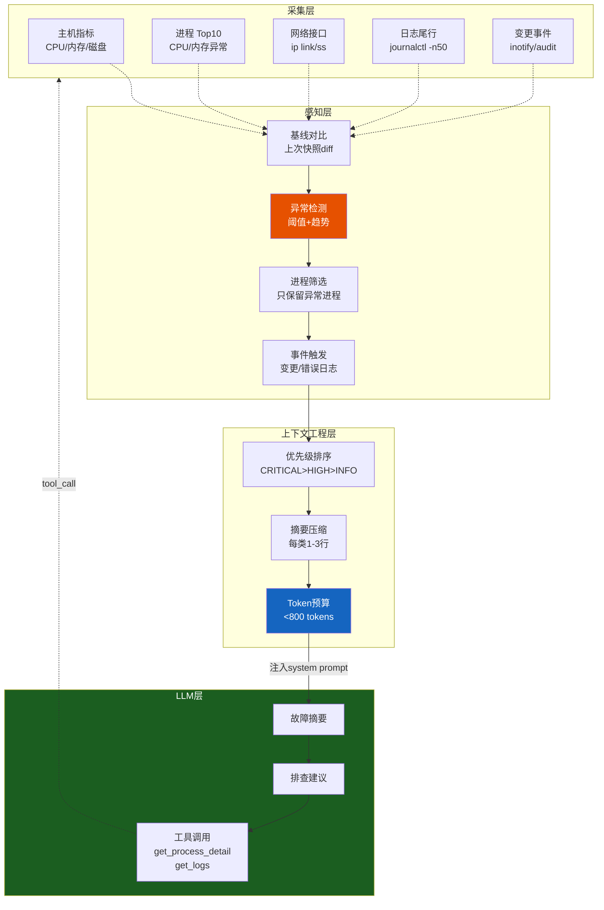
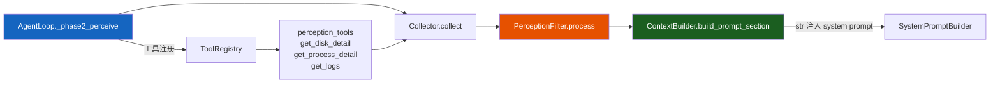

# DOC-5：感知层技术实现方案（v1.0）

> 覆盖模块：`perception/collector.py` · `perception/filter.py` · `perception/aggregator.py`（重构）· `tools/perception_tools.py`（新增）  
> 核心原则：**摘要推送 + 工具按需取**——感知层只向 LLM 注入异常摘要，详细数据通过工具调用按需获取  
>
> **v1.0 设计**：将现有 `aggregator.py` 拆分为四层职责；引入基线对比和异常筛选；配套按需查询工具

---

## 总体架构



---

## 层一：采集层 `perception/collector.py`

### 职责

**只负责拿原始数据**，不做任何判断。每次调用返回 `RawSnapshot`，不缓存，不过滤。

### 采集项与命令

| 采集项 | 命令 | 超时 | 说明 |
|--------|------|------|------|
| 主机指标 | `cat /proc/loadavg` + `free -b` | 1s | 负载 + 内存 |
| 磁盘 | `df -B1` | 2s | 所有挂载点字节数 |
| 进程 | `ps aux --sort=-%mem \| head -11` | 2s | Top 10 内存进程 |
| 网络接口 | `ip link show` | 1s | 接口状态 |
| 日志尾行 | `journalctl -n 50 -p warning --no-pager` | 3s | 最近 50 条 warning+ |
| 变更事件 | 内存队列（inotify 异步推送） | — | 文件变更事件 |

### 关键数据结构

```python
from dataclasses import dataclass, field
from typing import Any

@dataclass
class RawSnapshot:
    """采集层原始快照，不做任何过滤"""
    timestamp:      float
    load_avg:       tuple[float, float, float]   # 1/5/15 分钟
    memory_total_b: int
    memory_avail_b: int
    disks:          list[dict]                   # [{mount, total, used, avail}, ...]
    processes:      list[dict]                   # [{pid, name, cpu%, mem%}, ...]
    interfaces:     list[dict]                   # [{name, status}, ...]
    log_lines:      list[str]                    # 原始日志行
    change_events:  list[dict]                   # [{path, event_type, ts}, ...]
    errors:         dict[str, str]               # 采集失败的项 {item: error_msg}
```

### 接口签名

```python
class Collector:
    def __init__(self, config: "AgentConfig") -> None:
        self._timeout = config.perception_timeout_s   # 默认 5s

    async def collect(self) -> RawSnapshot:
        """并行采集所有项，单项失败不影响其他项"""

    async def _collect_host(self) -> tuple[tuple, int, int]:
        """负载 + 内存"""

    async def _collect_disk(self) -> list[dict]: ...
    async def _collect_processes(self) -> list[dict]: ...
    async def _collect_network(self) -> list[dict]: ...
    async def _collect_logs(self) -> list[str]: ...

    def push_change_event(self, path: str, event_type: str) -> None:
        """inotify 回调推送变更事件（异步安全）"""
```

### 关键算法伪代码

```
async function collect():
    results = await asyncio.gather(
        _collect_host(),
        _collect_disk(),
        _collect_processes(),
        _collect_network(),
        _collect_logs(),
        return_exceptions=True,   # 单项失败不崩溃
    )

    errors = {}
    for i, (key, result) in enumerate(zip(ITEMS, results)):
        if isinstance(result, Exception):
            errors[key] = str(result)
            results[i] = DEFAULT_EMPTY[key]

    return RawSnapshot(
        timestamp=time.time(),
        load_avg=results[0][0],
        memory_total_b=results[0][1],
        memory_avail_b=results[0][2],
        disks=results[1],
        processes=results[2],
        interfaces=results[3],
        log_lines=results[4],
        change_events=drain_change_queue(),
        errors=errors,
    )
```

---

## 层二：感知层 `perception/filter.py`

### 职责

**从原始数据里发现变化**。持有上一次快照作为基线，输出 `PerceptionResult`——只包含异常项和变化项，正常数据不输出。

### 检测规则

| 检测项 | 规则 | 输出级别 |
|--------|------|---------|
| 内存可用率 | < 10% → CRITICAL；< 20% → HIGH | CRITICAL / HIGH |
| 磁盘使用率 | > 95% → CRITICAL；> 85% → HIGH | CRITICAL / HIGH |
| 负载（1min） | > CPU核数×2 → HIGH；> CPU核数×4 → CRITICAL | HIGH / CRITICAL |
| 进程消失 | 上次存在、本次不存在 → HIGH | HIGH |
| 新增高内存进程 | mem% > 20% 且上次不存在 → INFO | INFO |
| 日志错误行 | 含 `error\|critical\|fatal\|oom` → HIGH | HIGH |
| 文件变更 | 变更路径含 `/etc/\|/bin/\|/lib/` → HIGH | HIGH |

### 关键数据结构

```python
from dataclasses import dataclass, field
from typing import Literal

AlertLevel = Literal["CRITICAL", "HIGH", "INFO"]

@dataclass
class PerceptionAlert:
    """单条异常告警"""
    level:    AlertLevel
    category: str          # disk / memory / process / log / change
    message:  str          # 人类可读的一行摘要
    detail:   dict         # 原始数据（供工具按需展开）

@dataclass
class PerceptionResult:
    """感知层输出，只含异常项"""
    timestamp:  float
    alerts:     list[PerceptionAlert]
    has_change: bool        # 与上次快照相比是否有变化
    baseline_age_s: float   # 基线距今多少秒（判断基线是否过期）
```

### 接口签名

```python
class PerceptionFilter:
    BASELINE_TTL = 300      # 基线有效期 5 分钟，过期后重建

    def __init__(self) -> None:
        self._baseline: RawSnapshot | None = None
        self._baseline_ts: float = 0.0
        self._cpu_count: int = os.cpu_count() or 4

    def process(self, snapshot: RawSnapshot) -> PerceptionResult:
        """对比基线，输出异常告警列表"""

    def reset_baseline(self) -> None:
        """强制重建基线（工具执行后调用）"""

    def _check_memory(self, snap: RawSnapshot) -> list[PerceptionAlert]: ...
    def _check_disk(self, snap: RawSnapshot) -> list[PerceptionAlert]: ...
    def _check_load(self, snap: RawSnapshot) -> list[PerceptionAlert]: ...
    def _check_processes(self, snap: RawSnapshot, baseline: RawSnapshot) -> list[PerceptionAlert]: ...
    def _check_logs(self, snap: RawSnapshot) -> list[PerceptionAlert]: ...
    def _check_changes(self, snap: RawSnapshot) -> list[PerceptionAlert]: ...
```

### 关键算法伪代码

```
function process(snapshot):
    alerts = []

    # 基线过期则重建（首次或超过 TTL）
    if baseline is None or (now - baseline_ts) > BASELINE_TTL:
        baseline = snapshot
        baseline_ts = now
        return PerceptionResult(alerts=[], has_change=False, ...)

    # 各项检测
    alerts += _check_memory(snapshot)
    alerts += _check_disk(snapshot)
    alerts += _check_load(snapshot)
    alerts += _check_processes(snapshot, baseline)
    alerts += _check_logs(snapshot)
    alerts += _check_changes(snapshot)

    # 按级别排序：CRITICAL > HIGH > INFO
    alerts.sort(key=lambda a: {"CRITICAL": 0, "HIGH": 1, "INFO": 2}[a.level])

    # 更新基线（正常情况下滚动更新）
    if not any(a.level == "CRITICAL" for a in alerts):
        baseline = snapshot
        baseline_ts = now

    return PerceptionResult(
        timestamp=snapshot.timestamp,
        alerts=alerts,
        has_change=len(alerts) > 0,
        baseline_age_s=now - baseline_ts,
    )
```

---

## 层三：上下文工程层（集成在 `aggregator.py`）

### 职责

**把 `PerceptionResult` 转成注入 LLM system prompt 的文本**，控制 token 预算，决定注入什么、不注入什么。

### 注入策略

| context 使用率 | 注入内容 |
|---------------|---------|
| < 70% | 所有告警（CRITICAL + HIGH + INFO）+ 系统概况 |
| 70–80% | 只注入 CRITICAL + HIGH 告警 |
| 80–85% | 只注入 CRITICAL 告警 |
| > 85% | 停止感知注入，只保留工具按需查询 |

### 感知摘要格式（注入 system prompt）

```
## 当前系统状态（{timestamp}）

[CRITICAL] 磁盘 /data 使用率 97%（剩余 3.2GB）
[HIGH]     内存可用 8%（1.2GB / 16GB）
[HIGH]     进程 mysqld (pid=1234) 内存占用 22%，较基线新增
[INFO]     负载 2.1 / 4.3 / 3.8（4核）

如需详细信息，可调用：
- get_disk_detail(mount="/data") — 查看磁盘详情
- get_process_detail(pid=1234)  — 查看进程详情
- get_logs(level="error", n=20) — 查看最近错误日志
```

### 接口签名

```python
class ContextBuilder:
    MAX_TOKENS = 800        # 感知摘要最大 token 预算

    def build_prompt_section(
        self,
        result: PerceptionResult,
        context_usage_ratio: float = 0.0,
    ) -> str:
        """生成注入 system prompt 的感知摘要文本"""

    def _format_alert(self, alert: PerceptionAlert) -> str:
        """单条告警格式化为一行"""

    def _estimate_tokens(self, text: str) -> int:
        """粗估 token 数（字符数 / 3）"""
```

---

## 层四：按需查询工具 `tools/perception_tools.py`

### 职责

LLM 看到摘要后，如需详细数据，通过工具调用按需获取。**不在感知摘要里全量推送**。

### 工具列表

| 工具名 | 参数 | 返回 | 说明 |
|--------|------|------|------|
| `get_disk_detail` | `mount: str` | 挂载点详情 + top 10 大目录 | 磁盘详细分析 |
| `get_process_detail` | `pid: int \| name: str` | 进程完整信息 + 文件句柄 | 进程诊断 |
| `get_logs` | `level: str, n: int, keyword: str` | 过滤后的日志行 | 日志查询 |
| `get_network_detail` | `interface: str` | 接口统计 + 连接数 | 网络诊断 |
| `get_system_snapshot` | — | 完整 RawSnapshot 摘要 | 全量系统状态 |

### 接口签名

```python
async def get_disk_detail(mount: str) -> ToolResult:
    """
    返回指定挂载点的详细磁盘信息：
    - 使用率、inode 使用率
    - du -sh 前 10 大目录
    - 最近 10 分钟内的写入速率（iostat）
    """

async def get_process_detail(pid: int | None = None, name: str | None = None) -> ToolResult:
    """
    返回进程详细信息：
    - 完整命令行、启动时间、父进程
    - 打开的文件句柄数
    - 内存映射摘要
    - 最近 CPU 使用趋势
    """

async def get_logs(
    level: str = "error",
    n: int = 50,
    keyword: str | None = None,
    since: str | None = None,   # e.g. "10 minutes ago"
) -> ToolResult:
    """
    返回过滤后的日志行（journalctl）
    level: debug / info / warning / error / critical
    """

async def get_network_detail(interface: str | None = None) -> ToolResult:
    """
    返回网络详情：
    - 接口统计（rx/tx bytes、errors、drops）
    - 活跃连接数（ss -s）
    - 监听端口列表
    """

async def get_system_snapshot() -> ToolResult:
    """
    返回完整系统状态快照（JSON 格式）
    用于 LLM 需要全面了解系统状态时
    """
```

---

## 感知触发时机

**不做定时轮询**，按以下事件触发：

| 触发时机 | 采集范围 | 说明 |
|---------|---------|------|
| 用户发送消息时 | 轻量快照（负载 + 内存） | < 50ms，不阻塞响应 |
| 工具执行完成后 | 相关项重采（磁盘操作→重采磁盘） | 感知工具执行影响 |
| 变更事件推送时 | 触发完整快照 | inotify 检测到关键路径变更 |
| LLM 主动调用工具时 | 按工具参数精确采集 | 按需，不全量 |

---

## 重构计划：`aggregator.py` → 四层拆分

现有 `aggregator.py` 将拆分为：

```
perception/
├── collector.py      # 层一：原始采集（从 aggregator 提取）
├── filter.py         # 层二：基线对比 + 异常检测（新增）
├── aggregator.py     # 层三：上下文工程（重构，只保留 build_prompt_section）
└── __init__.py
tools/
└── perception_tools.py  # 层四：按需查询工具（新增）
```

`agent_loop.py` 的 `_phase2_perceive` 调用链：

```python
async def _phase2_perceive(self, state: LoopState) -> str:
    snapshot = await self._collector.collect()
    result   = self._filter.process(snapshot)
    section  = self._context_builder.build_prompt_section(
        result,
        context_usage_ratio=self._estimate_context_usage(state),
    )
    return section   # 注入 system prompt，而非返回 dict
```

---

## 异常处理与安全边界

| 失效场景 | 后果 | 应对策略 |
|---------|------|---------|
| 采集命令超时 | 单项数据缺失 | `return_exceptions=True`，缺失项用空值填充，不中断主循环 |
| 基线数据损坏 | 误报或漏报 | 基线 TTL 到期自动重建；CRITICAL 告警不依赖基线（绝对阈值） |
| 感知摘要过长 | 挤占 LLM context | token 预算硬限 800，超出则按优先级截断 |
| 工具按需查询失败 | LLM 无法获取详情 | 工具返回 ToolResult(success=False)，LLM 收到错误信息后可换策略 |
| inotify 事件风暴 | 变更队列溢出 | 队列上限 100 条，超出丢弃旧事件并记录 warn |

---

## 与现有模块的接口关系


