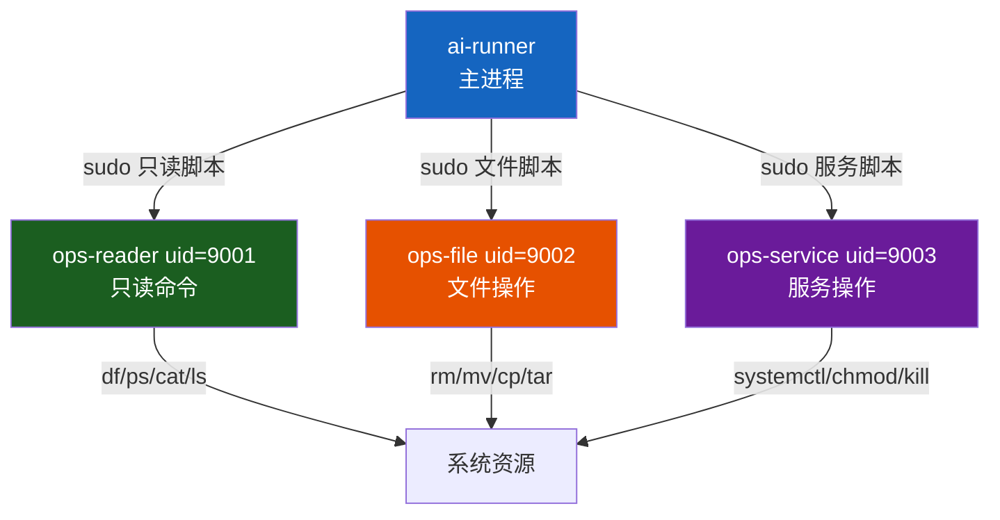
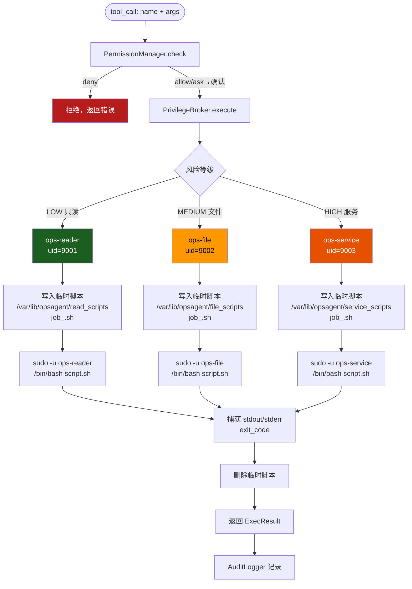

# DOC-6：最小权限执行层技术实现方案

> 覆盖模块：`security/privilege_broker.py`  
> 核心目标：**所有系统命令在受限账号下执行，主进程永不直接操作系统资源**  
>
> **设计版本记录**
> | 版本 | 变更 |
> |------|------|
> | v1.0 | 初稿：3账号体系 + 脚本沙箱 + 环境变量白名单 |
> | v1.1 | 安全加固：/tmp → /var/lib/opsagent；Fail Closed；账号拆分为4个；seccomp P2备选 |

---

## 一、为什么需要这个模块

LLM 生成的命令天然不可信。即使经过 `PermissionManager` 审批，命令本身仍然可能：

- 包含意外的副作用（`rm` 误删关键文件）
- 被提示词注入污染（工具输出里埋入恶意指令）
- 在 LLM 幻觉下生成超出预期范围的操作

最小权限执行的核心思想：**即使 Agent 被完全攻陷，攻击者获得的权限也被严格限制在操作系统层面**。这是安全管道的最后一道物理防线。

---

## 二、设计决策记录

### 决策 1：为什么用 sudo 而不是 setuid

**最初方案**：主进程以 root 运行，通过 `os.setuid()` 在 subprocess 里降权到 `ops-reader/ops-writer`。

**放弃原因**：
- 主进程必须是 root，部署风险极高——一旦主进程被攻破，攻击者直接拿到 root
- 演示环境需要以 root 启动 Agent，违反最小权限原则本身
- `setuid` 在容器环境（Docker）里默认被禁用，兼容性差

**最终选择**：主进程以普通用户 `ai-runner` 运行，通过 `sudo -u ops-reader/ops-writer` 切换执行身份。sudoers 只授权执行特定路径下的脚本，不授权任意命令。

---

### 决策 2：为什么用脚本文件而不是直接传命令参数

**最初方案**：`subprocess.run(["sudo", "-u", "ops-reader", "--"] + cmd_parts)`

**放弃原因（管道符陷阱）**：

运维命令几乎都包含管道，例如：
```bash
ps aux | grep nginx | awk '{print $2}'
```

`sudo` 不解析 shell 语法，管道符 `|` 会被当作字面参数传给第一个命令，导致执行失败。要支持管道就必须改成 `sudo bash -c "..."` 或 `sudo bash script.sh`。

一旦在 sudoers 里放开 `bash -c`，之前精心设计的二进制白名单（`/bin/ps`、`/bin/df`）就彻底失效——攻击者可以通过 `bash -c "rm -rf /"` 绕过所有限制。

**最终选择**：将命令写入临时脚本文件，sudoers 只授权执行特定目录下的 `.sh` 文件：

```
ai-runner ALL=(ops-reader) NOPASSWD: /bin/bash /tmp/opsagent/read_scripts/*
ai-runner ALL=(ops-writer) NOPASSWD: /bin/bash /tmp/opsagent/write_scripts/*
```

这样管道符、重定向、多行命令全部支持，同时 sudoers 的授权范围仍然是受控的。

---

### 决策 3：为什么不用 chattr +a 保护审计日志

**最初方案**：对审计日志文件执行 `chattr +a`（只允许追加，不允许删除或覆盖）。

**放弃原因**：
- `chattr +a` 与 `logrotate` 冲突——logrotate 无法截断或重命名文件，导致磁盘被爆
- 需要 root 权限才能设置 `chattr`，增加部署依赖
- 过度设计：在单机运维场景里，"Agent 被洗脑后主动删日志"的威胁优先级很低

**最终选择**：审计日志用 Python `open(path, 'a')` append-only 写入，文件权限 `644`，目录权限 `755`。logrotate 使用 `copytruncate` 模式处理，不影响正在写入的文件句柄。

---

### 决策 4：为什么需要显式环境变量白名单

`sudo` 默认重置环境变量（`env_reset`），导致：
- `PATH` 丢失，脚本里的命令找不到
- 云凭证（`AWS_PROFILE`、`KUBECONFIG`）丢失，运维工具无法认证

`sudo -E` 继承全部环境变量，但这会把 `LD_PRELOAD`、`LD_LIBRARY_PATH` 等危险变量也带进去，可能被用于库注入攻击。

**最终选择**：在 `PrivilegeBroker` 里维护一个 `safe_env` 白名单，只传递必要的变量：

```python
SAFE_ENV_KEYS = {
    "PATH", "HOME", "LANG", "LC_ALL",
    "KUBECONFIG", "AWS_PROFILE",   # 按需扩展
}
```

---

## 三、账号体系

```
ai-runner  (uid=1000)   ← 主进程身份，不直接执行系统命令
  ├── ops-reader  (uid=9001)  ← 只读：df/ps/cat/ls/journalctl/find
  ├── ops-file    (uid=9002)  ← 文件操作：rm/mv/cp/tar
  └── ops-service (uid=9003)  ← 服务操作：systemctl/chmod/kill
```

**账号拆分原因**：`chmod` 可改权限边界，`systemctl` 可重启服务，两者与 `rm/mv` 的爆炸半径差异显著，不应共享同一账号。3个账号在部署复杂度和安全粒度之间取得平衡（4个账号过重）。



---

## 四、执行流程



---

## 五、关键数据结构与接口

```python
import os
import stat
import subprocess
import tempfile
from dataclasses import dataclass
from pathlib import Path
from typing import Literal

Privilege = Literal["reader", "file", "service"]

SAFE_ENV_KEYS = {
    "PATH", "HOME", "LANG", "LC_ALL",
    "KUBECONFIG", "AWS_PROFILE",
}

READER_UID   = 9001;  READER_USER  = "ops-reader"
FILE_UID     = 9002;  FILE_USER    = "ops-file"
SERVICE_UID  = 9003;  SERVICE_USER = "ops-service"

# 专用目录，非 /tmp（/tmp 是全局可写，存在符号链接攻击和误删风险）
BASE_DIR         = Path("/var/lib/opsagent")
READ_SCRIPT_DIR  = BASE_DIR / "read_scripts"
FILE_SCRIPT_DIR  = BASE_DIR / "file_scripts"
SERVICE_SCRIPT_DIR = BASE_DIR / "service_scripts"


@dataclass
class ExecResult:
    success:   bool
    stdout:    str
    stderr:    str
    exit_code: int
    elapsed_ms: float
    op_id:     str
    privilege: Privilege
    script_path: str   # 已删除，仅用于审计记录


class PrivilegeBroker:
    def __init__(self, config: "AgentConfig") -> None:
        self._preflight_check()   # 启动时验证，失败则拒绝启动（Fail Closed）

    def execute(
        self,
        cmd:      str,        # 完整命令字符串，支持管道/重定向
        cmd_type: str,        # "read" / "file" / "service"（来自 CommandRiskResult.cmd_type）
        op_id:    str,
        timeout:  int = 30,
    ) -> ExecResult:
        """根据命令类型选择账号，写入临时脚本，sudo 执行，返回结果。
        risk 等级由 PolicyEngine 处理（决定是否执行），不传入此方法。
        """

    def _resolve_privilege(self, cmd_type: str) -> Privilege:
        """
        cmd_type（命令类型）决定账号，risk（风险等级）决定是否需要确认——两个维度独立。

        read    → ops-reader   (df/ps/cat/ls/journalctl)
        file    → ops-file     (rm/mv/cp/tar)
        service → ops-service  (systemctl/chmod/kill)
        未知    → ops-reader   (保守降级，不用高权限账号执行未知命令)

        cmd_type 来自 IntentClassifier.classify_command() 的 CommandRiskResult.cmd_type 字段。
        """

    def _preflight_check(self) -> None:
        """
        启动时验证安全环境，任何一项失败则 raise RuntimeError，拒绝启动（Fail Closed）。

        检查清单：
        □ sudo -l 能列出 opsagent 的三条规则
        □ getent passwd ops-reader / ops-file / ops-service 三个账号存在
        □ /var/lib/opsagent/{read,file,service}_scripts 目录存在
        □ 三个目录 owner=ai-runner，权限=700
        □ 用测试脚本验证 sudo -u ops-reader 实际可执行（echo ok）
        □ sudoers 语法正确（visudo -c）
        """

    def _write_script(self, cmd: str, privilege: Privilege) -> Path:
        """
        用 mkstemp 在对应目录创建临时脚本。
        写入后立即 chmod 700，防止 TOCTOU 窗口被利用。
        脚本头部加 set -euo pipefail，任意子命令失败立即退出。
        执行前验证目录完整性（权限、owner）。
        """

    def _build_safe_env(self) -> dict[str, str]:
        """从当前环境提取白名单变量，防止 LD_PRELOAD 等注入"""

    def _cleanup(self, script_path: Path) -> None:
        """执行完立即删除脚本，不留痕迹"""
```

---

## 六、关键算法

```
function execute(cmd, risk, op_id, timeout):
    privilege = _resolve_privilege(risk)
    user      = READER_USER if privilege == "reader" else WRITER_USER
    script    = _write_script(cmd, privilege)
    safe_env  = _build_safe_env()
    t0        = now()

    try:
        result = subprocess.run(
            ["sudo", "-u", user, "/bin/bash", str(script)],
            capture_output=True,
            text=True,
            timeout=timeout,
            env=safe_env,
        )
        return ExecResult(
            success   = (result.returncode == 0),
            stdout    = result.stdout,
            stderr    = result.stderr,
            exit_code = result.returncode,
            elapsed_ms= (now() - t0) * 1000,
            op_id     = op_id,
            privilege = privilege,
            script_path = str(script),
        )
    except subprocess.TimeoutExpired:
        return ExecResult(success=False, stderr="执行超时", ...)
    finally:
        _cleanup(script)


function _write_script(cmd, privilege):
    script_dir = READ_SCRIPT_DIR if privilege == "reader" else WRITE_SCRIPT_DIR
    script_dir.mkdir(parents=True, exist_ok=True)

    fd, path = tempfile.mkstemp(
        suffix=".sh",
        dir=script_dir,
        prefix=f"job_{op_id}_",
    )
    try:
        os.write(fd, f"#!/bin/bash\nset -euo pipefail\n{cmd}\n".encode())
    finally:
        os.close(fd)

    # 立即收紧权限，防止 TOCTOU 窗口被利用
    os.chmod(path, stat.S_IRWXU)   # 700
    return Path(path)
```

---

## 七、系统部署要求

```bash
# 创建账号（3个，按操作类型分离）
sudo useradd -r -u 9001 -s /sbin/nologin ops-reader
sudo useradd -r -u 9002 -s /sbin/nologin ops-file
sudo useradd -r -u 9003 -s /sbin/nologin ops-service

# 创建专用目录（/var/lib 而非 /tmp，避免全局可写目录的符号链接攻击）
sudo mkdir -p /var/lib/opsagent/{read,file,service}_scripts
sudo chown root:ai-runner /var/lib/opsagent
sudo chmod 750 /var/lib/opsagent
sudo chown ai-runner:ai-runner /var/lib/opsagent/{read,file,service}_scripts
sudo chmod 700 /var/lib/opsagent/{read,file,service}_scripts

# 配置 sudoers（visudo 验证语法，防止配置错误锁死系统）
sudo tee /etc/sudoers.d/opsagent << 'EOF'
ai-runner ALL=(ops-reader)  NOPASSWD: /bin/bash /var/lib/opsagent/read_scripts/*
ai-runner ALL=(ops-file)    NOPASSWD: /bin/bash /var/lib/opsagent/file_scripts/*
ai-runner ALL=(ops-service) NOPASSWD: /bin/bash /var/lib/opsagent/service_scripts/*
EOF
sudo chmod 440 /etc/sudoers.d/opsagent
sudo visudo -c  # 验证语法，部署脚本必须包含此步骤
```

---

## 八、异常处理与安全边界

| 失效场景 | 后果 | 应对策略 |
|---------|------|---------|
| sudo 未配置或账号不存在 | 安全环境未就绪 | **Fail Closed**：`_preflight_check()` 启动时验证，失败则 `raise RuntimeError` 拒绝启动，不降级到直接执行 |
| 脚本目录权限被篡改 | TOCTOU 攻击窗口扩大 | 每次写脚本前验证目录 owner 和权限，不符合则拒绝执行并告警 |
| 命令执行超时 | 子进程僵尸化 | `subprocess.run(timeout=30)` 超时后 SIGTERM，2s 后 SIGKILL |
| ops-writer 执行了破坏性命令 | 文件被删除/修改 | 这是最后防线，依赖前置的 PermissionManager + Hook 拦截；执行后触发快照对比 |
| LoongArch 架构兼容性 | sudo/bash 路径不同 | 路径通过 `shutil.which("sudo")` 动态查找，不硬编码 `/usr/bin/sudo` |

---

## 九、与其他模块的接口关系

```
PermissionManager.check()
    ↓ PermissionDecision(behavior="allow", risk_level="MEDIUM")
PrivilegeBroker.execute(cmd, risk="MEDIUM", op_id=...)
    ↓ ExecResult
AuditLogger.record(phase="execute", op_id=..., result=...)
    ↓
Snapshot.compare()   ← 写操作后对比快照验证副作用
```

`PrivilegeBroker` 不直接调用 `AuditLogger`，由 `agent_loop._phase4_execute` 在拿到 `ExecResult` 后统一记录，保持职责单一。

---

## 十、P2 备选增强（时间充足时考虑）

### seccomp 系统调用过滤

在脚本执行前加 seccomp 过滤，禁止网络调用、限制文件操作目录前缀：

```python
# 需要 pyseccomp 库，且需验证 LoongArch 架构的系统调用号兼容性
import seccomp
ctx = seccomp.SyscallFilter(seccomp.KILL)
ctx.add_rule(seccomp.ALLOW, "read")
ctx.add_rule(seccomp.ALLOW, "write")
# 禁止 socket（防止脚本发起网络请求）
ctx.load()
```

**注意**：LoongArch 架构的 seccomp 支持需要单独验证，系统调用号与 x86 不同。

### bubblewrap 轻量沙箱

```bash
bwrap --ro-bind / / \
      --bind /var/lib/opsagent /var/lib/opsagent \
      --dev /dev \
      --unshare-net \
      --unshare-all \
      /bin/bash script.sh
```

**注意**：需要内核支持 user namespace，麒麟 V11 上需确认是否开启。
