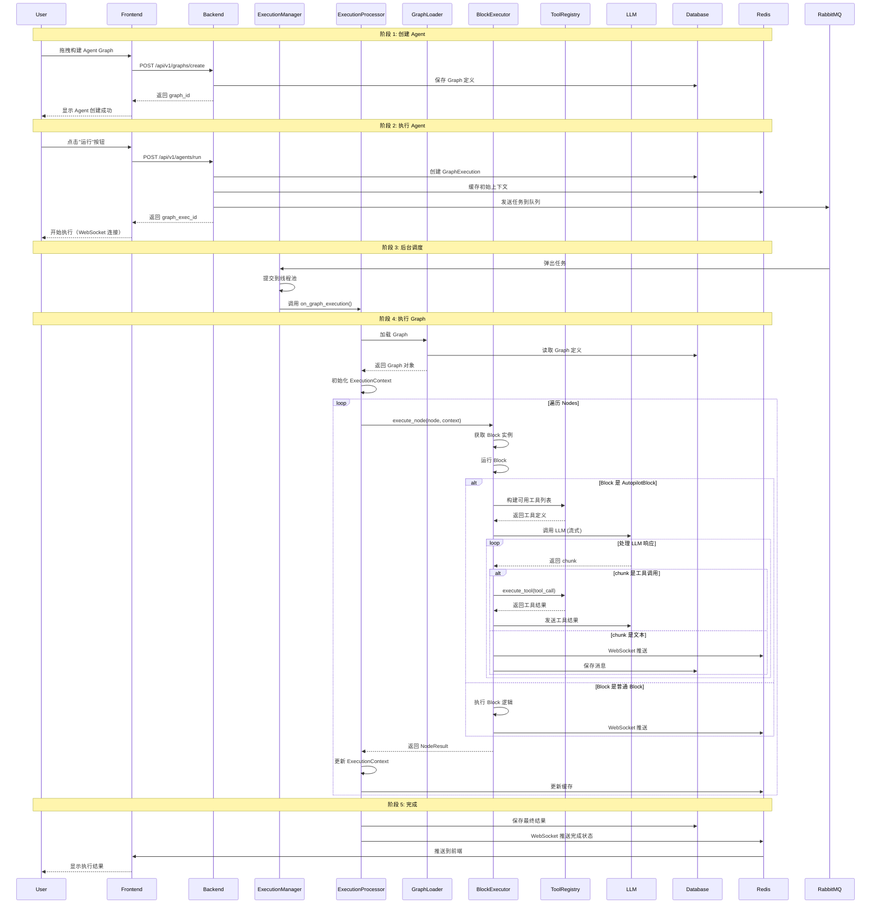

# 🔗 AutoGPT 模块协作深度解析

本文档深入分析 AutoGPT 各个模块如何结合到一起，如何联合协作，形成一个完整的 Agent 平台。

---

## 一、整体架构与模块连接

### 1.1 全景架构图

```
┌─────────────────────────────────────────────────────────────────────┐
│                        AutoGPT Platform                             │
└─────────────────────────────────────────────────────────────────────┘
                                    │
                                    ▼
┌─────────────────────────────────────────────────────────────────────┐
│                     Frontend Layer (Next.js)                        │
│  ┌──────────────┐  ┌──────────────┐  ┌──────────────┐  ┌───────────┐ │
│  │   Builder    │  │ Marketplace  │  │  Dashboard   │  │   Auth    │ │
│  └──────┬───────┘  └──────┬───────┘  └──────┬───────┘  └─────┬─────┘ │
└─────────┼────────────────┼────────────────┼────────────────┼─────────┘
          │                │                │                │
          │ REST API       │ WebSocket      │ REST API       │ OAuth     │
          ▼                ▼                ▼                ▼
┌─────────────────────────────────────────────────────────────────────┐
│                     Backend Layer (FastAPI)                          │
│  ┌──────────────────────────────────────────────────────────────┐  │
│  │                     API Routes Layer                          │  │
│  │  ┌─────────┐  ┌──────────┐  ┌──────────┐  ┌─────────────┐  │  │
│  │  │ Graph   │  │  Agent   │  │  CoPilot │  │ Integration │  │  │
│  │  │  API    │  │   API    │  │   API    │  │    API      │  │  │
│  │  └────┬────┘  └────┬─────┘  └────┬─────┘  └──────┬──────┘  │  │
│  └───────┼─────────────┼─────────────┼────────────────┼─────────┘  │
└──────────┼─────────────┼─────────────┼────────────────┼───────────┘
           │             │             │                │
           ▼             ▼             ▼                ▼
┌─────────────────────────────────────────────────────────────────────┐
│                      Execution Engine Layer                          │
│  ┌──────────────────────────────────────────────────────────────┐  │
│  │                  Execution Manager                             │  │
│  │  ┌──────────┐  ┌──────────┐  ┌──────────┐  ┌─────────────┐  │  │
│  │  │Scheduler │  │ Executor │  │ Simulator│  │  Billing    │  │  │
│  │  │  Pool    │  │   Pool   │  │   (Dry)   │  │  Tracker    │  │  │
│  │  └────┬─────┘  └────┬─────┘  └────┬─────┘  └──────┬──────┘  │  │
│  └───────┼─────────────┼─────────────┼────────────────┼─────────┘  │
└──────────┼─────────────┼─────────────┼────────────────┼───────────┘
           │             │             │                │
           ▼             ▼             ▼                ▼
┌─────────────────────────────────────────────────────────────────────┐
│                     Core Execution Layer                             │
│  ┌──────────────────────────────────────────────────────────────┐  │
│  │               ExecutionProcessor (AgentLoop)                  │  │
│  │  ┌──────────┐  ┌──────────┐  ┌──────────┐  ┌─────────────┐  │  │
│  │  │  Graph   │  │  Block   │  │   Tool   │  │   Context   │  │  │
│  │  │  Loader  │  │Executor  │  │ Registry │  │  Manager    │  │  │
│  │  └────┬─────┘  └────┬─────┘  └────┬─────┘  └──────┬──────┘  │  │
│  └───────┼─────────────┼─────────────┼────────────────┼─────────┘  │
└──────────┼─────────────┼─────────────┼────────────────┼───────────┘
           │             │             │                │
           ▼             ▼             ▼                ▼
┌─────────────────────────────────────────────────────────────────────┐
│                     Data & State Layer                              │
│  ┌──────────┐  ┌──────────┐  ┌──────────┐  ┌──────────────┐      │
│  │PostgreSQL│  │  Redis   │  │ RabbitMQ │  │   S3 Store   │      │
│  └──────────┘  └──────────┘  └──────────┘  └──────────────┘      │
└─────────────────────────────────────────────────────────────────────┘
           │             │             │                │
           ▼             ▼             ▼                ▼
┌─────────────────────────────────────────────────────────────────────┐
│                     External Services                               │
│  ┌──────────┐  ┌──────────┐  ┌──────────┐  ┌──────────────┐      │
│  │Supabase  │  │  OpenAI  │  │ Graphiti │  │    MCP       │      │
│  │ (Auth)   │  │  (LLM)   │  │(Memory)  │  │   Servers    │      │
│  └──────────┘  └──────────┘  └──────────┘  └──────────────┘      │
└─────────────────────────────────────────────────────────────────────┘
```

### 1.2 模块连接关系

```python
# 模块依赖图

# Frontend 依赖
Frontend ── REST API ──> Backend
Frontend ── WebSocket ──> Backend (实时通信)

# Backend 依赖
Backend ── REST API ──> Database (PostgreSQL)
Backend ── Cache ──> Redis
Backend ── Message Queue ──> RabbitMQ
Backend ── File Storage ──> S3

# Execution Engine 依赖
ExecutionManager ──> ThreadPoolExecutor (并发执行)
ExecutionManager ──> RabbitMQ (任务队列)
ExecutionProcessor ──> GraphLoader (加载 Graph)
ExecutionProcessor ──> BlockExecutor (执行 Blocks)
ExecutionProcessor ──> ToolRegistry (工具调用)

# Core Layer 依赖
GraphLoader ──> Database (读取 Graph 定义)
BlockExecutor ──> BaseBlock (Block 接口)
ToolRegistry ──> BaseTool (工具接口)
ContextManager ──> Redis (上下文缓存)

# External Services 依赖
CoPilot ──> OpenAI (LLM 调用)
Memory ──> Graphiti (知识图谱)
Integration ──> MCP Servers (第三方服务)
```

---

## 二、完整执行流程分析

### 2.1 用户创建 Agent 到执行的完整流程



### 2.2 代码流程详解

#### 步骤 1: 创建 Agent

```python
# backend/api/routes/graphs.py

@router.post("/graphs/create")
async def create_graph(
    graph_data: GraphCreate,
    current_user: User = Depends(get_current_user)
):
    """创建 Agent Graph"""
    
    # 1. 验证 Graph 结构
    validate_graph_structure(graph_data)
    
    # 2. 保存到数据库
    graph = await db_manager.graph.create(
        data={
            **graph_data.dict(),
            "user_id": current_user.id,
            "version": 1,
        }
    )
    
    # 3. 创建 Graph 文件（可选，用于版本控制）
    await create_graph_file(graph.id, graph_data)
    
    return {"graph_id": graph.id}
```

#### 步骤 2: 执行 Agent

```python
# backend/api/routes/agents.py

@router.post("/agents/run")
async def run_agent(
    graph_id: str,
    inputs: dict,
    current_user: User = Depends(get_current_user)
):
    """执行 Agent"""
    
    # 1. 创建 Graph Execution 记录
    graph_exec = await add_graph_execution(
        graph_id=graph_id,
        user_id=current_user.id,
        inputs=inputs,
    )
    
    # 2. 初始化执行上下文
    execution_context = ExecutionContext(
        user_id=current_user.id,
        graph_id=graph_id,
        graph_exec_id=graph_exec.id,
        inputs=inputs,
    )
    
    # 3. 缓存初始上下文
    await redis_client.set(
        f"context:{graph_exec.id}",
        execution_context.json(),
        ex=3600  # 1小时过期
    )
    
    # 4. 发送到执行队列
    rabbitmq.publish(
        exchange=GRAPH_EXECUTION_EXCHANGE,
        routing_key=GRAPH_EXECUTION_ROUTING_KEY,
        body=graph_exec.json()
    )
    
    # 5. 返回执行 ID
    return {
        "graph_exec_id": graph_exec.id,
        "status": "queued"
    }
```

#### 步骤 3: 后台调度

```python
# backend/executor/manager.py

class ExecutionManager:
    """执行管理器"""
    
    def __init__(self):
        self.executor_pool = ThreadPoolExecutor(max_workers=10)
        self.rabbitmq = SyncRabbitMQ()
    
    def run(self):
        """启动执行管理器（后台线程）"""
        while True:
            try:
                # 从队列获取任务
                message = self.rabbitmq.consume(
                    queue=GRAPH_EXECUTION_QUEUE_NAME,
                    auto_ack=False
                )
                
                # 解析任务
                graph_exec_entry = GraphExecutionEntry.parse_raw(message.body)
                
                # 提交到线程池
                self.executor_pool.submit(
                    self._execute_with_timeout,
                    graph_exec_entry,
                    cancel_event=threading.Event(),
                    cluster_lock=ClusterLock()
                )
                
                # 确认消息
                self.rabbitmq.ack(message)
                
            except Exception as e:
                logger.error(f"ExecutionManager error: {e}")
                time.sleep(1)
    
    def _execute_with_timeout(
        self,
        graph_exec_entry: GraphExecutionEntry,
        cancel_event: threading.Event,
        cluster_lock: ClusterLock
    ):
        """带超时的执行"""
        
        # 设置超时（30分钟）
        with Timeout(1800):
            try:
                # 调用执行处理器
                self.processor.on_graph_execution(
                    graph_exec_entry,
                    cancel_event,
                    cluster_lock
                )
            except TimeoutError:
                # 更新状态为超时
                await update_graph_execution_status(
                    graph_exec_entry.id,
                    ExecutionStatus.FAILED,
                    error="Execution timeout"
                )
            except Exception as e:
                # 更新状态为失败
                await update_graph_execution_status(
                    graph_exec_entry.id,
                    ExecutionStatus.FAILED,
                    error=str(e)
                )
```

#### 步骤 4: 执行 Graph

```python
# backend/executor/processor.py

class ExecutionProcessor:
    """执行处理器 - 核心 AgentLoop"""
    
    def __init__(self):
        self.logger = TruncatedLogger(...)
        self.db_client = get_database_manager_client()
        self.event_bus = get_execution_event_bus()
        self.compaction_tracker = CompactionTracker()
    
    def on_graph_execution(
        self,
        graph_exec_entry: GraphExecutionEntry,
        cancel_event: threading.Event,
        cluster_lock: ClusterLock
    ):
        """执行 Graph"""
        
        # 1. 加载 Graph
        graph = self.db_client.get_graph(graph_exec_entry.graph_id)
        
        # 2. 加载执行上下文
        execution_context = self._load_execution_context(graph_exec_entry.id)
        
        # 3. 更新状态为 RUNNING
        await self._update_status(graph_exec_entry.id, ExecutionStatus.RUNNING)
        
        try:
            # 4. 按顺序执行 Nodes
            for node in graph.nodes:
                # 检查取消事件
                if cancel_event.is_set():
                    break
                
                # 检查是否应该跳过
                if not self._should_execute_node(node, execution_context):
                    continue
                
                # 执行节点
                node_result = self._execute_node(node, execution_context)
                
                # 更新上下文
                execution_context.update(node_result)
                
                # 保存到缓存
                await self._save_execution_context(
                    graph_exec_entry.id,
                    execution_context
                )
                
                # 推送事件
                self.event_bus.emit(
                    ExecutionEventType.NODE_EXEC_UPDATE,
                    node_result
                )
            
            # 5. 执行完成
            await self._update_status(
                graph_exec_entry.id,
                ExecutionStatus.COMPLETED
            )
            
            # 6. 推送完成事件
            self.event_bus.emit(
                ExecutionEventType.EXECUTION_COMPLETED,
                {
                    "graph_exec_id": graph_exec_entry.id,
                    "final_outputs": execution_context.outputs,
                }
            )
        
        except Exception as e:
            # 执行失败
            await self._update_status(
                graph_exec_entry.id,
                ExecutionStatus.FAILED,
                error=str(e)
            )
            
            # 推送失败事件
            self.event_bus.emit(
                ExecutionEventType.EXECUTION_FAILED,
                {
                    "graph_exec_id": graph_exec_entry.id,
                    "error": str(e),
                }
            )
```

#### 步骤 5: 执行 Node

```python
# backend/executor/processor.py

def _execute_node(
    self,
    node: Node,
    execution_context: ExecutionContext
) -> NodeResult:
    """执行单个 Node"""
    
    # 1. 获取 Block 实例
    block = get_block(node.block_id)
    
    # 2. 准备输入数据
    input_data = self._prepare_input_data(
        node,
        execution_context
    )
    
    # 3. 执行 Block
    try:
        if isinstance(block, AutopilotBlock):
            # AutopilotBlock 特殊处理（流式）
            result = self._execute_autopilot_block(
                block,
                input_data,
                execution_context
            )
        else:
            # 普通 Block 执行
            result = asyncio.run(
                block.run(input_data, execution_context)
            )
        
        # 4. 返回结果
        return NodeResult(
            node_id=node.id,
            block_id=node.block_id,
            status="success",
            output=result,
            timestamp=datetime.utcnow()
        )
    
    except Exception as e:
        # 执行失败
        self.logger.error(
            f"Node execution failed: {node.id}",
            error=str(e)
        )
        
        return NodeResult(
            node_id=node.id,
            block_id=node.block_id,
            status="failed",
            error=str(e),
            timestamp=datetime.utcnow()
        )
```

#### 步骤 6: 执行 AutopilotBlock

```python
# backend/executor/processor.py

def _execute_autopilot_block(
    self,
    block: AutopilotBlock,
    input_data: AutopilotBlock.Input,
    execution_context: ExecutionContext
) -> AutopilotResult:
    """执行 AutopilotBlock"""
    
    # 1. 构建可用工具列表
    permissions = CopilotPermissions(
        tools=input_data.tools,
        tools_exclude=input_data.tools_exclude,
        blocks=input_data.blocks,
        blocks_exclude=input_data.blocks_exclude,
    )
    
    # 2. 获取工具定义
    tool_definitions = self._get_tool_definitions(permissions)
    
    # 3. 构建 System Prompt
    system_prompt = self._build_system_prompt(
        permissions,
        execution_context
    )
    
    # 4. 调用 Claude SDK（流式）
    client = ClaudeSDKClient(
        api_key=...,
        model="claude-3-5-sonnet-20241022",
    )
    
    messages = [
        {"role": "system", "content": system_prompt},
        {"role": "user", "content": input_data.prompt},
    ]
    
    # 5. 流式执行
    tool_calls = []
    response_parts = []
    
    try:
        for chunk in client.stream_chat_completion(
            messages=messages,
            tools=tool_definitions,
            max_tokens=input_data.max_tokens or 4096,
        ):
            # 处理 chunk
            if chunk.type == "content":
                # 文本响应
                response_parts.append(chunk.content)
                
                # 推送到前端
                self.event_bus.emit(
                    ExecutionEventType.TEXT_CHUNK,
                    {
                        "content": chunk.content,
                        "node_id": input_data.node_id,
                    }
                )
            
            elif chunk.type == "tool_use":
                # 工具调用
                tool_calls.append(chunk.tool_call)
                
                # 执行工具
                tool_result = self._execute_tool(
                    chunk.tool_call,
                    execution_context
                )
                
                # 发送工具结果
                messages.append({
                    "role": "assistant",
                    "content": None,
                    "tool_calls": [chunk.tool_call],
                })
                messages.append({
                    "role": "tool",
                    "tool_call_id": chunk.tool_call.id,
                    "content": json.dumps(tool_result),
                })
            
            elif chunk.type == "stop":
                # 完成
                break
        
        # 6. 返回结果
        return AutopilotResult(
            response="".join(response_parts),
            tool_calls=tool_calls,
            conversation_history=messages,
            token_usage=self._calculate_token_usage(messages),
        )
    
    except ContextSizeError:
        # 上下文大小错误 - 触发压缩
        logger.info("Context size error, triggering compaction")
        
        # 压缩历史记录
        compacted = self._compact_messages(messages)
        
        # 重试
        return self._execute_autopilot_block(
            block,
            input_data,
            execution_context,
            messages=compacted
        )
```

#### 步骤 7: 执行工具

```python
# backend/executor/processor.py

def _execute_tool(
    self,
    tool_call: ToolCall,
    execution_context: ExecutionContext
) -> dict:
    """执行工具"""
    
    # 1. 获取工具实例
    tool = TOOL_REGISTRY.get(tool_call.name)
    
    if not tool:
        raise ValueError(f"Tool not found: {tool_call.name}")
    
    # 2. 验证参数
    parameters = json.loads(tool_call.arguments)
    
    # 3. 注入执行上下文
    tool.context = execution_context
    
    # 4. 执行工具
    try:
        result = asyncio.run(
            tool.execute(**parameters)
        )
        
        return {
            "status": "success",
            "result": result,
        }
    
    except Exception as e:
        # 工具执行失败
        self.logger.error(
            f"Tool execution failed: {tool_call.name}",
            error=str(e)
        )
        
        return {
            "status": "failed",
            "error": str(e),
        }
```

---

## 三、数据流分析

### 3.1 数据流图

```
用户输入
    │
    ▼
[Frontend] ────────────────────────────────────────────┐
    │                                                    │
    │ POST /api/v1/agents/run                            │
    ▼                                                    │
[Backend API] ────────────────────────────────────────┐
    │                                                  │
    ├─► [Database] 保存 GraphExecution                 │
    │   - graph_exec_id                                │
    │   - status: "queued"                             │
    │   - inputs                                       │
    │                                                  │
    ├─► [Redis] 缓存初始上下文                          │
    │   - context:{graph_exec_id}                      │
    │   - ExecutionContext JSON                         │
    │                                                  │
    └─► [RabbitMQ] 发送任务                             │
        exchange: graph_execution                      │
        routing_key: graph.execution                    │
        body: GraphExecution JSON                       │
                                                      │
[RabbitMQ] ◄─────────────────────────────────────────┘
    │
    │ consume
    ▼
[ExecutionManager] ──────────────────────────────┐
    │                                             │
    ├─► 提交到 ThreadPoolExecutor                │
    │   max_workers: 10                          │
    │                                             │
    └─► 调用 ExecutionProcessor.on_graph_execution()
                                                  │
[ExecutionProcessor] ◄────────────────────────────┘
    │
    ├─► 加载 Graph
    │   └─► [Database] 查询 Graph 定义
    │       - nodes, links, constants
    │
    ├─► 加载上下文
    │   └─► [Redis] 读取 ExecutionContext
    │       - user_id, graph_id, inputs
    │
    │ 循环执行 Nodes
    │   │
    │   ├─► 获取 Block 实例
    │   │   └─► get_block(node.block_id)
    │   │
    │   ├─► 准备输入数据
    │   │   └─► 解析 Links，替换 $引用
    │   │       $node1.output → 实际数据
    │   │
    │   ├─► 执行 Block
    │   │   │
    │   │   └─► [AutopilotBlock]
    │   │       │
    │   │       ├─► 构建工具列表
    │   │       │   └─► TOOL_REGISTRY.get_allowed_tools()
    │   │       │
    │   │       ├─► 构建提示词
    │   │       │   └─► _build_system_prompt()
    │   │       │
    │   │       ├─► 调用 LLM
    │   │       │   └─► [Claude SDK]
    │   │       │       │
    │   │       │       ├─► 流式响应
    │   │       │       │   ├─► 文本 chunk
    │   │       │       │   │   └─► 推送到 WebSocket
    │   │       │       │   │   └─► 保存到 Database
    │   │       │       │   │
    │   │       │       │   └─► tool_use chunk
    │   │       │       │       │
    │   │       │       │       ├─► 获取工具实例
    │   │       │       │       │   └─► TOOL_REGISTRY.get()
    │   │       │       │       │
    │   │       │       │       ├─► 执行工具
    │   │       │       │       │   └─► tool.execute()
    │   │       │       │       │
    │   │       │       │       ├─► 保存工具结果
    │   │       │       │       │   └─► [Database] ChatMessage
    │   │       │       │       │
    │   │       │       │       ├─► 更新上下文
    │   │       │       │       │   └─► messages.append()
    │   │       │       │       │
    │   │       │       │       └─► 发送工具结果
    │   │       │       │           └─► LLM 继续
    │   │       │       │
    │   │       │       └─► 返回最终响应
    │   │       │
    │   │       └─► 返回 AutopilotResult
    │   │
    │   └─► 更新上下文
    │       └─► execution_context.update()
    │
    ├─► 保存执行结果
    │   └─► [Database] 更新 GraphExecution
    │       - status: "completed"
    │       - outputs
    │       - node_results
    │
    └─► 推送完成事件
        └─► [EventBus] 发送事件
            └─► [WebSocket] 推送到前端
```

### 3.2 关键数据结构

```python
# ExecutionContext - 执行上下文（贯穿整个执行流程）
class ExecutionContext(BaseModel):
    """执行上下文 - 数据流的核心载体"""
    
    # 基本信息
    graph_exec_id: str
    graph_id: str
    user_id: str
    status: ExecutionStatus
    
    # 输入输出
    inputs: dict[str, Any]
    outputs: dict[str, Any]
    
    # 节点执行状态
    node_outputs: dict[str, Any]  # node_id -> output
    node_errors: dict[str, str]   # node_id -> error
    
    # Autopilot 特定
    messages: list[ChatMessage]  # 对话历史
    tool_calls: list[ToolCall]   # 工具调用记录
    
    # 权限和配置
    permissions: CopilotPermissions
    model: str
    
    # 更新方法
    def update(self, node_result: NodeResult):
        """更新上下文"""
        if node_result.status == "success":
            self.node_outputs[node_result.node_id] = node_result.output
        else:
            self.node_errors[node_result.node_id] = node_result.error
    
    def get_input_data(self, node: Node) -> dict:
        """获取节点的输入数据"""
        input_data = {}
        
        # 默认输入
        input_data.update(node.input_default)
        
        # 常量输入
        input_data.update(node.constant_input)
        
        # 动态输入（从 Links 解析）
        for link in get_links(target_id=node.id):
            source_output = self.node_outputs.get(link.source_id)
            if source_output:
                input_data[link.target_key] = source_output[link.source_key]
        
        return input_data

# NodeResult - 节点执行结果
class NodeResult(BaseModel):
    node_id: str
    block_id: str
    status: str
    output: Optional[Any]
    error: Optional[str]
    timestamp: datetime

# AutopilotResult - AutopilotBlock 执行结果
class AutopilotResult(BaseModel):
    response: str
    tool_calls: list[ToolCall]
    conversation_history: list[ChatMessage]
    token_usage: dict
```

---

## 四、事件系统

### 4.1 事件总线架构

```python
# backend/events/event_bus.py

class ExecutionEventBus:
    """执行事件总线 - 模块间通信的核心"""
    
    def __init__(self):
        self._subscribers: dict[str, list[Callable]] = {}
        self._redis_pubsub = RedisPubSub()
    
    def emit(
        self,
        event_type: ExecutionEventType,
        data: dict,
        user_id: str = None,
        graph_id: str = None,
        graph_exec_id: str = None
    ):
        """发布事件"""
        
        # 构建事件对象
        event = ExecutionEvent(
            event_type=event_type,
            data=data,
            user_id=user_id,
            graph_id=graph_id,
            graph_exec_id=graph_exec_id,
            timestamp=datetime.utcnow(),
        )
        
        # 1. 本地订阅者
        if event_type in self._subscribers:
            for callback in self._subscribers[event_type]:
                try:
                    callback(event)
                except Exception as e:
                    logger.error(f"Event callback error: {e}")
        
        # 2. Redis 发布（跨进程）
        self._redis_pubsub.publish(
            channel=f"exec_events:{graph_exec_id or '*'}",
            message=event.json()
        )
    
    def subscribe(
        self,
        event_type: ExecutionEventType,
        callback: Callable[[ExecutionEvent], None]
    ):
        """订阅事件"""
        if event_type not in self._subscribers:
            self._subscribers[event_type] = []
        self._subscribers[event_type].append(callback)
    
    async def listen(
        self,
        user_id: str = None,
        graph_id: str = None,
        graph_exec_id: str = None
    ):
        """监听事件（异步生成器）"""
        
        # 构建监听频道
        if graph_exec_id:
            channel = f"exec_events:{graph_exec_id}"
        elif graph_id:
            channel = f"exec_events:*"
        else:
            channel = "exec_events:*"
        
        # 订阅 Redis 频道
        async for message in self._redis_pubsub.subscribe(channel):
            event = ExecutionEvent.parse_raw(message)
            
            # 过滤事件
            if user_id and event.user_id != user_id:
                continue
            if graph_id and event.graph_id != graph_id:
                continue
            if graph_exec_id and event.graph_exec_id != graph_exec_id:
                continue
            
            # 返回事件
            yield event
```

### 4.2 事件类型与处理

```python
# backend/events/events.py

class ExecutionEventType(str, Enum):
    """执行事件类型"""
    
    # 执行生命周期事件
    GRAPH_EXECUTION_STARTED = "graph_execution_started"
    GRAPH_EXECUTION_COMPLETED = "graph_execution_completed"
    GRAPH_EXECUTION_FAILED = "graph_execution_failed"
    GRAPH_EXECUTION_TERMINATED = "graph_execution_terminated"
    
    # 节点执行事件
    NODE_EXEC_STARTED = "node_exec_started"
    NODE_EXEC_UPDATE = "node_exec_update"
    NODE_EXEC_COMPLETED = "node_exec_completed"
    NODE_EXEC_FAILED = "node_exec_failed"
    
    # 流式响应事件
    TEXT_CHUNK = "text_chunk"
    TOOL_CALL = "tool_call"
    TOOL_RESULT = "tool_result"
    
    # Autopilot 特定事件
    COMPACTION_STARTED = "compaction_started"
    COMPACTION_COMPLETED = "compaction_completed"

# 事件处理示例
class WebSocketHandler:
    """WebSocket 处理器"""
    
    def __init__(self, event_bus: ExecutionEventBus):
        self.event_bus = event_bus
    
    async def handle_websocket(
        self,
        websocket: WebSocket,
        graph_exec_id: str
    ):
        """处理 WebSocket 连接"""
        
        await websocket.accept()
        
        # 订阅事件
        async for event in self.event_bus.listen(graph_exec_id=graph_exec_id):
            # 发送到前端
            await websocket.send_json({
                "event_type": event.event_type.value,
                "data": event.data,
                "timestamp": event.timestamp.isoformat(),
            })

class BillingTracker:
    """计费追踪器"""
    
    def __init__(self, event_bus: ExecutionEventBus):
        self.event_bus = event_bus
        self.event_bus.subscribe(
            ExecutionEventType.TOOL_CALL,
            self._on_tool_call
        )
    
    def _on_tool_call(self, event: ExecutionEvent):
        """处理工具调用事件"""
        # 记录成本
        token_usage = event.data.get("token_usage", {})
        model = event.data.get("model")
        
        cost = self._calculate_cost(model, token_usage)
        
        # 保存到数据库
        await db_manager.cost_log.create(
            data={
                "graph_exec_id": event.graph_exec_id,
                "model": model,
                "cost": cost,
                "token_usage": token_usage,
            }
        )
```

---

## 五、状态管理

### 5.1 状态同步机制

```python
# backend/state/state_manager.py

class StateManager:
    """状态管理器 - 多层级缓存"""
    
    def __init__(self):
        self._local_cache: dict[str, dict] = {}  # 进程内缓存
        self._redis_client = redis_client
        self._db_client = db_client
    
    async def get_execution_state(
        self,
        graph_exec_id: str
    ) -> ExecutionContext:
        """获取执行状态（多级缓存）"""
        
        # 1. 进程内缓存（最快）
        if graph_exec_id in self._local_cache:
            return ExecutionContext.parse_raw(
                self._local_cache[graph_exec_id]
            )
        
        # 2. Redis 缓存（快）
        cached = await self._redis_client.get(f"state:{graph_exec_id}")
        if cached:
            state = ExecutionContext.parse_raw(cached)
            # 同步到本地缓存
            self._local_cache[graph_exec_id] = state.json()
            return state
        
        # 3. 数据库（慢）
        graph_exec = await self._db_client.graph_execution.find_unique(
            where={"id": graph_exec_id}
        )
        
        if not graph_exec:
            raise ValueError(f"Graph execution not found: {graph_exec_id}")
        
        state = ExecutionContext(
            graph_exec_id=graph_exec.id,
            graph_id=graph_exec.graph_id,
            user_id=graph_exec.user_id,
            status=graph_exec.status,
            inputs=graph_exec.inputs,
            outputs=graph_exec.outputs,
            node_outputs=graph_exec.node_outputs or {},
            node_errors=graph_exec.node_errors or {},
        )
        
        # 同步到缓存
        await self._save_execution_state(state)
        
        return state
    
    async def save_execution_state(
        self,
        state: ExecutionContext
    ):
        """保存执行状态（多级同步）"""
        
        # 1. 本地缓存
        self._local_cache[state.graph_exec_id] = state.json()
        
        # 2. Redis 缓存
        await self._redis_client.setex(
            f"state:{state.graph_exec_id}",
            3600,  # 1小时过期
            state.json()
        )
        
        # 3. 数据库（异步，不阻塞）
        asyncio.create_task(
            self._db_client.graph_execution.update(
                where={"id": state.graph_exec_id},
                data={
                    "status": state.status,
                    "outputs": state.outputs,
                    "node_outputs": state.node_outputs,
                    "node_errors": state.node_errors,
                }
            )
        )
    
    def invalidate(self, graph_exec_id: str):
        """失效缓存"""
        if graph_exec_id in self._local_cache:
            del self._local_cache[graph_exec_id]
        
        asyncio.create_task(
            self._redis_client.delete(f"state:{graph_exec_id}")
        )
```

### 5.2 状态转换

```python
# backend/state/state_transitions.py

VALID_STATUS_TRANSITIONS = {
    ExecutionStatus.QUEUED: [
        ExecutionStatus.INCOMPLETE,
        ExecutionStatus.TERMINATED,
        ExecutionStatus.REVIEW,
    ],
    ExecutionStatus.INCOMPLETE: [
        ExecutionStatus.RUNNING,
    ],
    ExecutionStatus.RUNNING: [
        ExecutionStatus.COMPLETED,
        ExecutionStatus.FAILED,
        ExecutionStatus.TERMINATED,
        ExecutionStatus.REVIEW,
    ],
    ExecutionStatus.FAILED: [
        ExecutionStatus.QUEUED,  # 重试
        ExecutionStatus.TERMINATED,
    ],
    ExecutionStatus.REVIEW: [
        ExecutionStatus.RUNNING,
        ExecutionStatus.TERMINATED,
    ],
}

def transition_status(
    current_status: ExecutionStatus,
    new_status: ExecutionStatus
) -> bool:
    """状态转换"""
    
    allowed_transitions = VALID_STATUS_TRANSITIONS.get(current_status, [])
    
    if new_status not in allowed_transitions:
        raise InvalidStatusTransitionError(
            f"Invalid status transition: {current_status} -> {new_status}"
        )
    
    return True

# 使用示例
async def update_execution_status(
    graph_exec_id: str,
    new_status: ExecutionStatus,
    error: str = None
):
    """更新执行状态"""
    
    # 获取当前状态
    current = await get_execution_status(graph_exec_id)
    
    # 验证状态转换
    transition_status(current.status, new_status)
    
    # 更新状态
    await db_manager.graph_execution.update(
        where={"id": graph_exec_id},
        data={
            "status": new_status,
            "error": error,
        }
    )
    
    # 发布状态变更事件
    event_bus.emit(
        ExecutionEventType.GRAPH_EXECUTION_STATUS_CHANGED,
        {
            "old_status": current.status,
            "new_status": new_status,
            "error": error,
        },
        graph_exec_id=graph_exec_id
    )
```

---

## 六、关键协作场景

### 6.1 场景 1：AutopilotBlock 执行时的多模块协作

```
[用户] 点击"运行"
    │
    ▼
[ExecutionManager] 从队列获取任务
    │
    ├─► 提交到 ThreadPoolExecutor
    │
    ▼
[ExecutionProcessor] on_graph_execution()
    │
    ├─► [GraphLoader] 加载 Graph
    │   └─► 从 Database 读取
    │
    ├─► [StateManager] 加载上下文
    │   └─► 多级缓存（本地 → Redis → DB）
    │
    ▼
执行 Node (AutopilotBlock)
    │
    ├─► [CopilotPermissions] 检查权限
    │   └─► 过滤工具和 Block
    │
    ├─► [ToolRegistry] 获取可用工具
    │   └─► 根据 Permissions 过滤
    │
    ├─► [PromptBuilder] 构建提示词
    │   └─► 结合系统提示词 + 上下文
    │
    ▼
[Claude SDK] stream_chat_completion()
    │
    ├─► [OpenAI API] 调用 LLM
    │
    ├─► 流式返回 chunks
    │   │
    │   ├─► TEXT_CHUNK
    │   │   │
    │   │   ├─► [EventBus] 发送事件
    │   │   │   └─► [WebSocket] 推送到前端
    │   │   │
    │   │   └─► [StateManager] 保存消息
    │   │       └─► 更新上下文
    │   │
    │   └─► TOOL_USE
    │       │
    │       ├─► [ToolRegistry] 获取工具实例
    │       │   └─► TOOL_REGISTRY.get(tool_name)
    │       │
    │       ├─► [Tool] 执行工具
    │       │   │
    │       │   ├─► ReadTool
    │       │   │   └─► [FileStorage] 读取文件
    │       │   │
    │       │   ├─► WriteTool
    │       │   │   └─► [FileStorage] 写入文件
    │       │   │
    │       │   ├─► WebSearchTool
    │       │   │   └─► [SearchAPI] 搜索网络
    │       │   │
    │       │   └─► RunBlockTool
    │       │       └─► 递归执行 Block
    │       │
    │       ├─► [StateManager] 保存工具结果
    │       │   └─► messages.append()
    │       │
    │       └─► [BillingTracker] 记录成本
    │           └─► 计算并保存
    │
    └─► STOP
        │
        ├─► [StateManager] 保存最终结果
        │   └─► 更新执行状态
        │
        └─► [EventBus] 发送完成事件
            └─► [WebSocket] 推送到前端
```

### 6.2 场景 2：多 Agent 协作

```
[主 Agent] AutopilotBlock
    │
    ├─► LLM 决定需要子 Agent
    │
    ├─► 调用 run_block 工具
    │   └─► block_id: agent_executor
    │       graph_id: sub_agent_graph_123
    │
    ▼
[AgentExecutorBlock] 执行子 Agent
    │
    ├─► 创建子 GraphExecution
    │   └─► parent_execution_id: main_exec_id
    │
    ├─► 发送到队列
    │   └─► RabbitMQ
    │
    ▼
[ExecutionManager] 处理子任务
    │
    ├─► 提交到线程池
    │
    ▼
[ExecutionProcessor] on_graph_execution()
    │
    ├─► 加载子 Agent Graph
    │
    ├─► 执行子 Agent Nodes
    │   │
    │   └─► [Sub Agent AutopilotBlock]
    │       │
    │       ├─► 执行工具
    │       │
    │       └─► 返回结果
    │
    ▼
[子 Agent] 完成
    │
    ├─► 保存结果
    │
    └─► [EventBus] 发送事件
        └─► 监听者: 主 Agent
            └─► 接收子 Agent 输出
                └─► 继续执行
```

### 6.3 场景 3：上下文压缩

```
[AutopilotBlock] 执行中
    │
    ├─► 调用 LLM
    │
    └─► ContextSizeError ❌
        │
        ├─► 触发压缩逻辑
        │
        ▼
[CompactionTracker] 开始压缩
    │
    ├─► emit_start_if_ready()
    │   └─► [EventBus] 发送 COMPACTION_STARTED
    │
    ├─► [Transcript] strip_progress_entries()
    │   └─► 移除进度条等冗余数据
    │
    ├─► [LLM] compress_context()
    │   └─► 生成历史摘要
    │
    ├─► emit_end_if_ready()
    │   └─► [EventBus] 发送 COMPACTION_COMPLETED
    │
    ▼
[ExecutionProcessor] 重试
    │
    ├─► 使用压缩后的消息
    │
    ├─► 重新调用 LLM
    │
    └─► 成功 ✅
```

---

## 七、总结

### 7.1 模块协作的关键模式

1. **事件驱动架构**
   - EventBus 作为核心通信枢纽
   - 松耦合的模块间通信
   - 支持异步和跨进程

2. **多级缓存策略**
   - 本地缓存 → Redis → 数据库
   - 减少数据库压力
   - 提升响应速度

3. **状态机模式**
   - 明确的状态转换规则
   - 防止非法状态转换
   - 事件驱动的状态更新

4. **插件化架构**
   - Block 作为可插拔组件
   - 统一的接口规范
   - 易于扩展

5. **流式处理**
   - WebSocket 实时推送
   - 增量式结果返回
   - 提升用户体验

### 7.2 关键设计决策

| 设计决策 | 原因 | 影响 |
|---------|------|------|
| 使用 RabbitMQ 作为消息队列 | 可靠的消息传递、持久化、支持重试 | 确保任务不丢失，支持分布式 |
| 使用 WebSocket 推送事件 | 实时通信、双向通信 | 用户体验好，实时反馈 |
| 使用 Redis 缓存状态 | 高性能、支持过期 | 减少数据库压力，提升响应速度 |
| 使用 PostgreSQL 持久化 | 关系型数据、事务支持 | 数据一致性，支持复杂查询 |
| 使用 Graph 定义工作流 | 可视化、易于理解 | 用户体验好，降低学习成本 |

### 7.3 与 OpsAgent 的协作对比

| 协作维度 | AutoGPT | OpsAgent |
|---------|---------|----------|
| **模块通信** | EventBus（事件驱动） | 直接函数调用 |
| **状态管理** | 多级缓存（本地 → Redis → DB） | 内存 + SQLite |
| **并发模型** | ThreadPoolExecutor | asyncio |
| **事件系统** | 完整的事件总线 | 简单的日志记录 |
| **数据流** | 显式的数据流（ExecutionContext） | 隐式的消息传递 |
| **错误处理** | 事件驱动的错误通知 | try-catch + 错误恢复策略 |

---

**最后更新**: 2026-04-21
**分析版本**: AutoGPT Platform (Latest)
